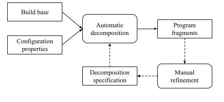

.. _dev_decomposition_conf:

Configuring Program Decomposition
=================================

The section presents a tutorial for program decomposition in Klever.
Thorough verification is poorly scalable.
Thus, one needs to bound the scope of each verification target.
Decomposition of a program into :term:`program fragments <Program fragment>` is an essential solution for reducing
verification complexity.
The decomposition process should be done very accurately to balance required efforts for environment modeling and
verification tool capabilities.
It is hardly possible to propose any fully automatic solution to this problem.
Klever provides means for both manual and automatic selection of source files for program fragments to meet user needs.

The Klever verification framework uses fragmentation tactics to decompose programs into fragments.
Then composition tactics can combine program fragments into larger ones.
There are additional decomposition specifications to control outputted program fragments' content.
The figure below illustrates the workflow of Program Fragment Generator (PFG) that implements the approach in Klever.

We refer to each new type of programs to be verified as a project.
Klever expects to have the fragmentation tactic implemented for the project in the :file:`klever/core/pfg/fragmentation`
directory of :term:`$KLEVER_SRC`.
You should use the *FragmentationAlgorythm* class as an ancestor to define your new fragmentation tactics.
The new implementation may iterate over a build commands graph, program files graph and callgraph from the project's
build base to fulfill the decomposition.
Besides, there should be an appropriate decomposition specification in the :file:`presets/jobs/fragmentation sets`
directory of :term:`$KLEVER_SRC`.

A new :file:`job.json` file created for the project should have the following two options set there:

.. code-block:: json

  {
    "project": "project's name"
    "fragmentation tactic": "tactic's name"
  }

Note that the configuration property *project* should match the tactic's file in the
:file:`klever/core/pfg/fragmentation` directory (the project name may have the capitalized wording).
The second property helps to choose the fragmentation tactic when several variants are available.
The provided value should be set in the file with the project's tactic name residing in the
:file:`presets/jobs/fragmentation sets` directory.
Be default Klever uses the fragmentation tactic having attribute *reference* with the *true* value.

Let's consider the content of the :file:`Linux.json` file to make it clear how decomposition specifications can be set
up:

.. code-block:: json

  {
    "tactics": {
      "separate modules": {
        "reference": true,
        "kernel": false,
        "ignore dependencies": true
      },
      "modules groups": {
        "kernel": false
      },
      "subsystems": {
        "kernel": true
      },
      "subsystems with modules": {
        "kernel": true,
        "add modules by coverage": true
      }
    },
    "fragmentation sets": {
      "3.14": {
        "reference": true,
        "fragments": {
          "drivers/usb/serial/usbserial.ko": [
            "drivers/usb/serial/usb_debug.ko",
            "drivers/usb/serial/usbserial.ko"
          ],
          "drivers/usb/serial/ch341.ko": [
            "drivers/usb/serial/ch341.ko",
            "drivers/usb/serial/generic.c"
          ],
          "drivers/usb/serial/usb_wwan.ko": [
            "drivers/usb/serial/usb_wwan.ko",
            "drivers/usb/serial/option.ko"
          ]
        }
      }
    }
  }

The decomposition specification has two parts: *tactics* and *fragmentation sets*.
The former contains set of configuration parameters for the fragmentation tactic that can be chosen by the
*fragmentation tactic* configuration property in the :file:`job.json` file.
Options are specific to the tactic implementation.
For instance, there are several variant in the aforementioned example:

* **separate modules** extracts loadable modules from the Linux kernel as individual program fragments.
* **module groups** works as the previous one but tries to merge some interdependent modules together heuristically
  in addition.
* **subsystems** extracts files from the same directory built in the  main Linux kernel object file as separate program
  fragments called subsystems.
* **subsystems with modules** works as the previous one but tries to find modules that call functions exported by
  subsystems to check them together as new program fragments.
  This fragmentation tactic may require providing more input files, such as code coverage reports from previous Klever
  runs.

The second part of the decomposition specification allows to adjust program fragments manually.
These program fragments are added to generated ones automatically or supersede program fragments with the same names.
Entries of the attribute correspond to the project's versions that can be provided using the *specifications set*
configuration property in the :file:`job.json` file.
Such sets can contain an enumeration of names of files, directories or existing program fragments for new program
fragments given via the *fragments* attribute.
Additional configuration properties *add to all fragments* and *exclude from all fragments* modify all generated program
fragments.
These options expect lists of file names with paths or regular expressions as values.

A user may choose any generated program fragments to verify by setting *targets* and *exclude targets* configuration
properties in :file:`job.json`.
Program fragment names or regular expressions can be provided as values.
