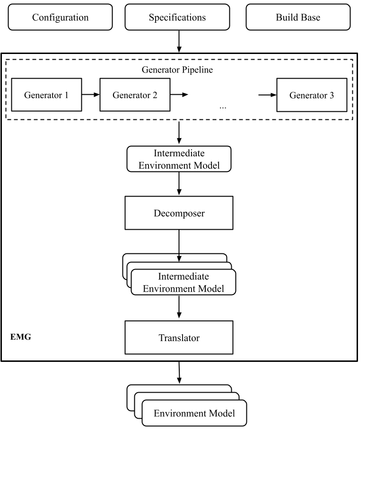
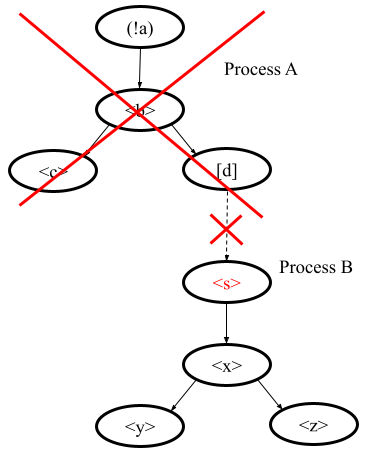
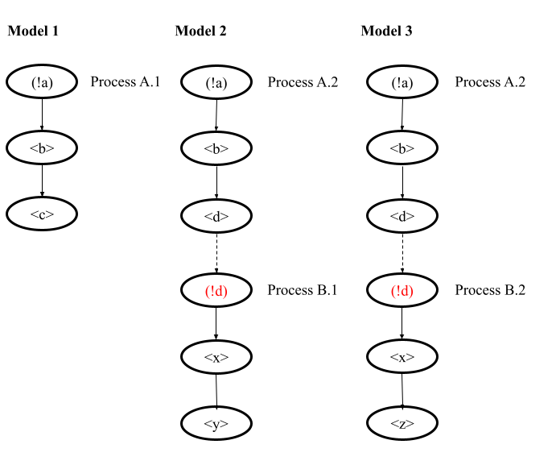

.. _dev_env_model_specs:

Development of Environment Model Specifications
===============================================

Libraries, user inputs, other programs, etc. constitute an environment that can influence a program execution.
It is necessary to provide a model which represents certain assumptions about the environment to verify any program:

* It should contain models of undefined functions which the program calls during execution and which can influence
  verification results.
* It should correctly initialize external global variables.
* It should contain an **entry-point** function for a verification tool to start its analysis from it.
  User-space programs have the **main** function that can be used as an entry point, but operating systems and other
  system software require adding an artificial one.

Our experience shows that bug-finding is possible even without accurate environment models.
Still, precise environment models help to improve code coverage and avoid false alarms.
It is crucial to provide the accurate environment model considering the specifics of checked requirements and programs
under verification to achieve high-quality verification results.
It becomes even more essential to provide the appropriate environment model to avoid missing faults and false alarms
verifying program fragments.

Environment Model Generator
^^^^^^^^^^^^^^^^^^^^^^^^^^^

The environment models generation step follows the program decomposition.
Provided program is decomposed into separate independent :term:`program fragments <Program fragment>`.
Each program fragment consists of several C source files.
We call these files below program files.

EMG is a Klever component (plugin) that generates an environment model for a single provided program fragment.
It is highly configurable and extendable, so a user needs to prepare its proper configuration to verify a new program.

A JSON file with the requirement specifications base has a section with templates.
Such templates contain a *plugins* entry that lists the configuration of different plugins to run.
The EMG should always be the first one.
See the example in :file:`presets/jobs/specification/Linux.json` in :term:`$KLEVER_SRC`:

.. code-block:: json

  {
    "templates": {
    "loadable kernel modules and kernel subsystems": {
    "plugins": [
      {
        "name": "EMG",
        "options": {
          "generators options": [
            {"linuxModule": {}},
            {"linuxInsmod": {}},
            {"genericManual": {}}
          ],
          "translation options": {
          "allocate external": false
        }
      }
    ]
  }

The member with the **options** name contains the EMG configuration.
There are descriptions of supported configuration parameters in the following sections of the document.

EMG generates an environment model as the *main C file* and several aspect files intended for weaving their content to
program files. We refer to these output files as aspect files.
Each aspect file contains the code to add at the beginning of a program file or its end and a description of function
calls and macros to replace with models.

EMG generates environment models using the provided source code given as a project build base and *specifications*.
Specifications are C files or JSON files with models in C or DSL languages.
We distinguish specifications and environment models:

* The environment model is a file in an intermediate EMG notation or in C.
  The former is a file in the internal representation which is called an *intermediate environment model (IEM)*.
  The former is called the *final environment model (FEM)*.

* Environment model specifications can describe IEMs for specific program fragments, models’ templates, parts, or even
  configuration parameters.
  Specifications are always prepared or modified by hand and provided as input to EMG.

The Klever presets directory has the *specifications* directory.
It contains all specifications for different programs and components.
EMG does not require pointing to specific files at providing specifications.
It searches for all specifications in the directory and applies only relevant ones.
Files of specifications for the EMG plugin have a particular naming policy.
Their names always end with a suffix that distinguishes their utilization.
These suffixes are described below.

EMG Components
--------------

EMG has a modular architecture, so one needs to know it to configure the plugin and/or even extend it properly.
The picture below shows its components:

The input of the EMG component includes the configuration parameters (plugin configuration), specifications and the
build base with the source code and its meta-information.

The output of the component consists of several environment models for the given program fragment.

There are three main components in the EMG that a user must appropriately configure: Generator pipeline, Decomposer, and
Translator.
These components are considered below in detail, but we give information about their primary functions in this section.

The Generator pipeline runs several generators one by one.
Generators yield parts of the IEM.
Generated parts are independent and form the IEM as a parallel composition.

Decomposer separates the IEM into several simplified parts that can be verified independently.
This step is optional.

Translator prepares the C code based on the provided IEM.
It applies many simplifications to the input model.
If there are several input models, several Translator instances are executed and generated FEMs are independent.

EMG Configuration
-----------------

There are the following main configuration parameters of the EMG plugin:

.. list-table:: Main EMG configuration parameters.
  :widths: 10 25 10 55
  :header-rows: 1
  :align: left
  :class: tight-table

  * - Configuration Parameter
    - Value Type
    - Default Value
    - Description
  * - specifications set
    - String
    - None
    - The value is an identifier of the specification set.For example, an identifier can
      correspond to a particular Linux kernel version.
      The LinuxModule generator expects one of the following values: 3.14, 4.6.7, 4.14, 4.16, 5.5.
      The parameter can be provided directly in the :file:`job.json` file.
  * - generators options
    - Object
    - None
    - The list defines the sequence of generators in the Generators pipeline. For example:

      "generators options": [
      {"linuxModule": {}},  {"linuxInsmod": {}},
      {"genericManual": {}}
      ]
  * - translation options
    - Object
    - None
    - An object with configuration parameters for Translator.
  * - single environment model per fragment
    - Bool
    - true
    - The false value activates Decomposer.
      It is described in a separate section as its extra configuration parameters.
      This parameter is required to be set in :file:`job.json` directly.
  * - dump types
    - Bool
    - false
    - The property is intended for debugging.
      Generate a file *type collection.json* with the list of imported types.
  * - dump source code analysis
    - Bool
    - false
    - The property is intended for debugging.
      Generate files :file:`vars.json`, :file:`functions.json`, :file:`macros.json`.

Intermediate Environment Model
^^^^^^^^^^^^^^^^^^^^^^^^^^^^^^

EMG generates an IEM before translating it to the C language.
The model is combined as a parallel composition from parts prepared by generators.
The model also can be fully designed by hand and provided directly to the EMG using a specific generator
(genericManual).
We refer to such input files as *user-defined environment model specifications UDEMS*.
Specifications for other generators include only templates or additional information to generate parts of IEMs.

IEMs and UDEMSes have the same notation.
It is a JSON file.
However, the structure of files containing these two kinds of models is slightly different.
We consider the notation of only UDEMSes below because such specifications include IEMs.

Structure of UDEMS
------------------

A root is an object that maps *specification set identifiers* (related to configuration property *specifications set*
mentioned above) to specifications itself.
Specification sets are intended to separate models for different versions of a program.
The specification contains IEMs meant for particular program fragments.
The example below shows the organization of a file with a UDEMS:

.. code-block:: json

  {
    "5.5": [
      {
        "fragments": [
          "ext-modules/manual_model/unsafe.ko",
          "ext-modules/manual_model/safe.ko"
        ],
        "model": {}
      }
    ]
  }

Program fragment identifiers are generated automatically by Klever at verification.
One can get these names from attributes of plugin reports or verification results in the web interface.
Also, the PFG component report contains the list of all generated program fragments.

The *model* value is an IEM provided to the EMG.

We do not give the precise theoretical semantics of the notation in the document.
You can find them in the following papers [Z18]_, [N18]_, [ZN18]_.
Instead, we describe the semantics intuitively by making analogies with program execution.
We say about execution and running of processes, but even in the C code, IEM cannot be ever executed.
It is intended only for analysis by software verification tools, so we say this just to avoid overcomplications.

Each IEM is a parallel composition of transition systems called *processes*.
Each transition system can be considered as a thread executed by an operating system.
The model contains *environment processes*.
Each transition system has a state and can do actions to change the state.
The state is defined by values of labels.
Intuitively labels can be considered as local variables on the stack of a process.

A model consists of a main process, environment processes and function models.
Both three are described with process descriptions, but semantically they are different.
The main process is like a thread that acts from the very beginning of a combination of a program and environment model.
It may trigger execution of a program or send signals to activate environment processes.
While a program code is executed, it may call functions that are replaced by models.
Function models are not processes or threads in any sense, they just act within the same scope, they can send signals to
environment processes but cannot receive any.

Environment processes exist from the very beginning of execution as the main process does.
But any such process expects a signal to be sent to it for activation before doing any other activity.
Signals are described below in more detail.

Each label has a C type.
Any process can do block actions and send/receive signals.
A block action is a C base block with C statements over program fragment global variables and labels.
Signals pass values of labels and synchronize the sequence of actions between processes.

Process Actions
---------------

A process performs actions.
There are actions of following kinds:

* block actions describe operations performed by the model.
* send/receive actions establish synchronization.
* jump actions help to implement loops and recursion.

The behavior of an environment model is often nondeterministic.
Let’s consider a typical combination of an environment model with a program fragment source code.
The semantics will be the following:

* The main process starts doing its actions from the very beginning first.
* It would either call a function from the program fragment or send an activating signal to any of environment model
  processes.
* The process transfer follows the rendezvous protocol:

  * The sender waits until there is a receiver in the state when it can take a receiving action.
  * Then the receive happens in no time. Nothing can happen during the receive.
  * If a receiver or a sender may do any other action instead of signal sending, they are allowed to attempt it leaving
    the other process still waiting.
    But if a process has the only option (sending or receiving a signal), then it cannot bypass it.
  * If there are several possible receivers or dispatchers, then the two are chosen randomly.

* If there is a signal receiver that belongs to environment processes, it begin doing his actions.
  So, there are the main process and recently activated environment processes doing their actions in parallel with each
  other.
* If a process attempts doing its base block action, then it waits until it is executed before doing next actions.
  The code may contain calls of functions defined in a program fragment.
  Such code can call undefined functions for which there are function models in turn.
  When execution reach the function call with an existing function model, the following switch of execution happens:

  * The host process which is doing his base block action still cannot attempt any other actions.
  * The execution of the source code of the base block is paused.
  * A new function model begins its execution in the same context.
  * The function model attempts doing its actions as  any other process.
    It may do base block execution, send signals, etc.
  * The last action of the function model should contain the return statement with values provided back to the paused
    code as any function does after its finishing.
  * The execution of the source code of the base block is resumed.
  * Other processes do their stuff in parallel during the described procedure as usual.

We propose a simple DSL to describe possible sequences of actions that can be performed by the environment.

The order of actions is specified in the *process* attribute entry of a process description (considered below) using a
simple language:

* <name> is a base block action;
* (!name) or (name) is a signal receiving.
  Where (!name) means that the process waits for a signal to start doing actions.
  The (name) is a signal receiving action that can be used in any place except as the first action.
* [name] is a signal sending action.
* {jump} is an auxiliary jump action that just specifies a new sequence of actions to do.
  Each jump action has its process entry.
  Jumps do not form a stack: a process does not return to an interrupted action sequence.

Order of actions is described with the help of two operators:

#. "**.**" is a sequential combination operator.
   Actions *a* . *b* combined this way mean *b* follows *a*.

#. "**\|**" is a non-deterministic choice operator.
   Only one action of combined ones will be selected for *a* \| *b*.
   But verification tools analyse both options as possible alternatives.

A sequential combination operator has a higher priority than choices.
Parentheses in expressions can also be used, but do not confuse them with signal receiving.

All actions can have conditions or guards (look at the table in the next section).
But they work differently in different situations:

* **Receive:** condition is a guard to check whether the signal can be received.
* **Dispatch:** skip the action if the guard is not feasible.
* **Jump:** conditions are not supposed to be added.
* **Base block:**

  * **In choice operator:** do not choose the whole branch of actions.
    Let’s consider an example *(<a>.<b>.<c> \| <d>)*.
    Imagine, *a*, *b* and *c* have conditions.
    Then if the *a*’s condition is false, both *a*, *b*, *c* cannot be chosen.
    The same if the *d* ’s condition is infeasible (*d* will be skipped).
    But if the *b*’s condition is not evaluated to be true, *a* can be chosen, *b* will be just skipped, and *d* will be
    done.
  * **In sequential combination:** skip the action if the guard is evaluated to false.

There are several examples of actions order written down using the proposed notations and corresponding state machines
describing that order:

The first example:
process = (!a).<b>.(<c> \| <d>).(f)

The second example:
process = (!a).<b>.(<c> \| {d}).[e] where jumping action is d = <f>.{d} \| [e].

The third example:
process = (!a).<b>.(<c>.[e] \| <f>)

The example demonstrates the usage of conditions in first base block actions of the choice operator.

Model Description
-----------------

Let us consider the notation of the UDEMSes.

Each process has an identifier consisting of a category and name.
Categories of environment processes can be shared.
A category reflects which part of an environment is modeled by specific processes.
Processes’ identifiers should be unique, but names can be reused.

Note that names of models, processes and some actions are used by the web interface and it is very important to keep
them short and clear.

The root object has the following attributes:

.. list-table:: IEM root members.
  :widths: 12 40 40 8
  :header-rows: 1
  :align: left
  :class: tight-table

  * - Name
    - Value type/default value
    - Description
    - Required
  * - name
    - string/"base"
    - The name of the model.
    - No
  * - main process
    - *Process description* object/*null*.
    - The main process describes the first process of the environment model that does not wait for any registering
      signals.
    - No
  * - environment processes
    - Value is an object that maps process identifiers (a category and process name separated by "/" symbol) to process
      descriptions.
      Process identifiers are used in attributes.
      A category and process name should be C identifiers.
      Example:

      {
      "category1/name1": {process description},
      "category2/name2": {process description}
      }
    - Names are identifiers of processes described in values.
    - No
  * - functions models
    - Value is an object that maps enumerations of function names to corresponding process descriptions:

      {"name1, ..., nameN": {process description},
      "name": {process description}}

    - A name of the member is a string which is an enumeration of function names.
      These functions will be replaced by models generated from the provided process descriptions.
    - No

The model’s name is not necessary but the EMG component can generate several models per program fragment and such models
would have distinguished names.

An example of a UDEMS structure is given below.
Processes’ descriptions are omitted.

.. code-block:: json

  {
    "name": "Example",
    "main process": {},
    "environment processes": {
      "platform/main": {},
      "platform/PowerManagement": {}
    },
    "functions models": {
      "f1, f2": {}
    }
  }

A process description has the following attributes:

.. list-table:: Process description members.
  :widths: 12 40 40 8
  :header-rows: 1
  :align: left
  :class: tight-table

  * - Name
    - Value type/default value
    - Description
    - Required
  * - comment
    - Arbitrary string
    - The comment is used at error-trace visualization.
      It should describe what the process implements.
    - Yes
  * - headers
    - A list of relative paths to header files:

      ["stdio.h", "pthread.h"]
    - Headers are included in the main C file of an environment model to bring type definitions and function
      declarations to the main C file of the FEM.
    - No
  * - relevant
    - Bool
    - If the flag is true, then the process description will be used for other specification sets.
    - No
  * - labels
    - The object maps label names to label descriptions.
      Label names should be C identifiers.

      {"var": {...},
      "ret": {...}}
    - Labels represent the state of a process.
    - No
  * - actions
    - The object maps action names to action descriptions.
      Action names should be C identifiers.
    - Actions describe the behavior of the environment model.
    - Yes
  * - process
    - Process transition relation (see its description below).
    - Transition relation describes the possible order of actions performed by the process.
    - Yes
  * - declarations
    - The option maps names of program source files or *environment model* (meaning the main C file) to maps from C
      identifiers to declarations to add.
      C identifiers are used to combine declarations from different process descriptions at translation.
      If identifiers from different process descriptions match, then only one value is selected for the main C file.

      {"dir/name.c": {"func": "extern void func(void);"}, "environment model": {"func": "void func(void);"}}
    - Declarations are added to the beginning of the given files (program files or the main C file).
    - No
  * - definitions
    - The object maps names of program fragment files or *environment model* (mean the main C file) to maps from C
      identifiers to definitions of functions to add or paths to C files to inline.
      In the case of a C file, whole its content will be weaved into the program file or main C file.

      To generate the wrapper for a static function in the program fragments’s source code, one can use a shorter form
      with members declaration and wrapper members.
      The former is the declaration of the target static function, the latter is the name of the wrapper to generate.

      {
      "file.c": {
      "myfunctions": "linux/file.c",
      "wrapper": ["void wrapper(void) {", "func();", "}"],
      "callback": {"declaration": "static void callback(void)", "wrapper": "emg_callback"}
      }
      }
    - Definitions work the same way as declarations, but definitions are multi-line and added after declarations to
      files of a program fragment or the main C file.
    - No
  * - peers
    - The map from process identifiers to lists of action names.

      "peers": {"c/name": ["register"]}
    - The member describes which processes are connected with this one.
      Keys of the map list names of processes that can send signals to the process or receive signals from it.
      Values enumerate corresponding sending and receiving actions.
    - No

There is an example of a process description with simplified values below:

.. code-block:: json

  {
    "headers": ["linux/platform_device.h"],
    "labels": {},
    "declarations": {
        "environment model": {
            "get_dev_id": "const struct platform_device_id *get_dev_id(struct platform_driver *drv);"
        }
    },
    "definitions": {
        "environment model": {
            "get_dev_id": [
                "const struct platform_device_id *get_dev_id(struct platform_driver *drv) {",
                "\treturn & drv->id_table[0];",
                "}"
            ]
        }
    },
    "process": "(!register).<probe>.(<ok>.{pm_jump} | <fail>).<free>.(deregister)",
    "actions": {
        "pm_jump": {},
        "register": {},
        "deregister": {},
        "probe": {},
        "ok": {},
        "fail": {},
        "free": {},
        "pm": {},
        "release": {}
    }
  }

The *headers* member has a single header to add.
It is necessary to allocate memory and dereference pointers to :c:struct:`platform_driver` and
:c:struct:`platform_device` structures.
We will describe labels and actions below with more discussion.
*Declarations* and *definitions* members introduce a function :c:func:`get_dev_id` to use in actions.
Its definition and declaration will be added to the main C file of the FEM.
We suggest users to implement more complicated functions in separate C files and provide a path to them instead of the
list of strings.

Labels
~~~~~~

Each label has a type and value just as variables.
A label can have any C type respecting the scope of the main C file.
An initial value for the label should be provided directly as a string.
It can refer to any variables from the scope of the main C file.

An object that describes a label has the following attributes:

.. list-table:: Label description members.
  :widths: 12 40 40 8
  :header-rows: 1
  :align: left
  :class: tight-table

  * - Name
    - Value type/default value
    - Description
    - Required
  * - declaration
    - Declaration of the C type, e.g.:
      void \*ptr
    - The attribute stores the type of the label.
    - Yes
  * - value
    - String
    - String with an optional initial value of the label respecting its type.
    - No

There is an example of labels descriptions for the example provided above.

.. code-block:: json

  "labels": {
    "driver": {"declaration": "struct platform_driver \*s"},
    "device": {"declaration": "struct platform_device \*device"},
    "msg": {"declaration": "pm_message_t msg"},
    "ret": {"declaration": "int a", "value": "ldv_undef_int_nonpositive()"}
  }

Jump Actions
~~~~~~~~~~~~

Before we will consider how these labels are used in actions, let us consider the order of actions and provide a
description of the *pm_jump* jump action.

The sequence of actions provided within a process attribute can be reduced to another sequence implemented in jump
action.
Its description can have the following attributes.

.. list-table:: Jump action description.
  :widths: 12 40 40 8
  :header-rows: 1
  :align: left
  :class: tight-table

  * - Name
    - Value type/default value
    - Description
    - Required
  * - comment
    - String with the action description.
    - Comments help users to understand error traces better.
    - Yes
  * - process
    - Process transition relation (see its description below)
    - Transition relation of the subprocess.
    - Yes

The code below demonstrates the action description of the *pm_jump* action for the example provided above.

.. code-block:: json

  "pm_jump": {
    "comment": "Run PM callbacks or just remove the driver.",
    "process": "(<pm> | <none>).<release>.<free>.(deregister)"
  }

Together with the process member of the process description they set the following order of actions:

Signaling Actions
~~~~~~~~~~~~~~~~~

Signal dispatches and receives have parameters and names.
A signal can be passed if there are two processes: one should have a dispatch action, and another should have a
receiving one.
Names of actions, the number of parameters, and their types should be the same.

Currently, the implementation of EMG does not support arbitrary signal exchange between processes as such models would
be too complicated for verification tools.
An environment process can receive signals only as a first action and as the last action.
The first received signal is called registration and the last one is deregistration.
A function model cannot receive signals but can send them anytime.

Signaling action description can have the following attributes:

.. list-table:: Signal action description.
  :widths: 12 40 40 8
  :header-rows: 1
  :align: left
  :class: tight-table

  * - Name
    - Value type/default value
    - Description
    - Required
  * - comment
    - String with the action description.
    - Comments help users to understand error traces better.
    - Yes
  * - condition
    - The same as in conditions of base block actions.
      It is also allowed to use incoming parameters of the signal at receive actions: use *$ARG1*, ..., *$ARGN*
      expressions.
    - The condition restricts the acceptance of signals with the proper name but unexpected values.
    -
  * - parameters
    - A list of label names to save received values or send values from.

      ["%ret%, "%struct%"]
    - Labels to save or send data.
    - Yes
  * - require
    - The object is a map from process identifiers to objects with the *include* attribute.
      The latter lists actions required for this one.

      {"c/p1": {"include": ["probe", "success"]}}
    - The attribute says that the action requires another process that should have specific actions in turn.
      This field is used only at the decomposition of models, which is considered in the following chapters.
    - No
  * - savepoints
    - Map of savepoint names to savepoint objects.
    - Savepoints are used at decomposition, and they are considered in the following sections in detail.
    - No

The examples of register and deregister action descriptions from the example above are given below:

.. code-block:: json

  "register": {
      "comment": "Register the platform callbacks in the kernel.",
      "parameters": ["%driver%"]
    },
    "deregister": {
      "comment": "Finish platform callbacks calling.",
      "condition": ["%driver% == $ARG1"],
      "parameters": ["%driver%"]
  }

The registering action does not have any condition and just saves the received pointer to the platform_driver structure
to the driver label.
The deregistering action has a guard that checks that the deregistration is performed for the already registered device.

Base Block Actions
~~~~~~~~~~~~~~~~~~

Base blocks contain statements in the C programming language.
These statements over labels are used to compose the code of a FEM.
A user may call any functions, use any global variables and labels of the process but concerning the scope of the main
C file.
The EMG does not resolve scope issues for you, and to add more variables, types, or functions to the file, one should
include or implement additional headers and maybe wrappers of static functions.

Base block action descriptions have the following attributes:

.. list-table:: Block action description.
  :widths: 12 40 40 8
  :header-rows: 1
  :align: left
  :class: tight-table

  * - Name
    - Value type/default value
    - Description
    - Required
  * - comment
    - String with the action description.
    - Comments help users to understand error traces better.
      It is used for error-trace visualization.
    - Yes
  * - condition
    - String with a boolean statement over global variables or labels.
      % symbols enclose label names.
      "%ret% == 0 && %arg% != 0"
    - If the condition is feasible, then a verifier can go analyzing the action.
      If it is infeasible and not the first action of a sequence which is an option of the choice operator, then the
      action is skipped, and the following is attempted.
      If the action is the first in a sequence considered as an option of a choice operator, then the whole series is
      deemed to be unfeasible.

      Example 1: <a>.<b>.<c>
      If <b> has an invalid condition, then <b> is just skipped.
      Example 2: <a>.<b> | <c>.<d>
      If the <a> action’s condition is false then <a>.<b> branch cannot be chosen at all.
    - No
  * - statements
    - List of strings with statements to execute over global variables or labels. % symbols enclose label names.

      [
      "%one% = 1;",
      "%ret% = callback(%one%);",
      "ldv_assume(%ret%);"
      ]
    - Statements describe state changing.
      There are just strings with the C code that can call functions from the program fragment or auxiliary C files,
      access or modify labels and global variables.
    - No
  * - trace relevant
    - Bool
    - True if the action should always be shown in the error trace.
      If it is false, then in some cases error traces would hide the action.
    - Yes

Each base block is independent.
Its source code should be correct.
Avoid leaving open brackets, parentheses, or incomplete operators.
It is also forbidden to declare new variables in base blocks.

To use the variables and functions from the program, one needs to include header files as other files of the program
fragment do.
There are several ways to do it:

#. Add required headers to the *additional header* configuration parameter.
   These headers will be added to all output models.
   For this purpose, you may create a separate header file in the specifications directory and include this single file.
#. Add headers to the "headers* attribute of a specific process in the UDEMS.
   This approach works only using genericManual and linuxModule generators.

The default value of *additional header* configuration parameter lists several files.
Find them in the last section devoted to Translator.
Inspect them before writing specifications.
There are helpful functions there to:

* allocate and free memory;
* insert assumptions in the code;
* initialize undefined values of certain types to implement non-deterministic behavior;
* create and join threads in parallel models.

Sometimes entry points that should be called by the environment models are implemented as static functions.
Implement wrappers using *definitions* and *declarations* members of a process description in the case.

There are several auxiliary expressions allowed in base block statements:

* $ALLOC(%\*labelname*\%);
      Allocate memory according to the label type size (the label is expected to be a pointer) using
      :c:func:`ldv_xmalloc` function.
* $UALLOC(%\*labelname*\%);
      Allocate memory according to the label type size (the label is expected to be a pointer) using
      :c:func:`ldv_xmalloc_unknown_size` function.
* $ZALLOC(%\*labelname*\%);
      Allocate memory according to the label type size (the label is expected to be a pointer) using
      :c:func:`ldv_xzalloc` function.
* $FREE(%\*labelname*\%);
      Free memory by :c:func:`ldv_free` function.

It is allowed to use function parameters when describing statements and conditions of function models.
To do that one may use expressions *$ARG1*, *$ARG2*, etc.

Environment models are connected with requirement specifications.
There are two main functions to initialize the model state of requirement specifications and do final checks:

* :c:func:`ldv_initialize`;
* :c:func:`ldv_check_final_state`.

Read about them in the tutorial related to the requirement specifications development.
Remember that you may implement more functions that connect requirements with environment models.
Just implement proper header files to use them in your models.

Another issue is source code weaving.
Requirement specifications and function models in IEMs replace function calls and macro expansion by corresponding
models.
But functions in IEM and requirement specifications are never replaced this way.
Keep it in mind developing your specifications.

There are descriptions of the block actions for the example considered above:

.. code-block:: json

  "probe": {
    "comment": "Probe the device.",
    "statements": [
        "$ALLOC(%device%);",
        "%device%->id_entry = get_dev_id(%driver%);",
        "%ret% == %driver%->probe(%device%);"
    ]
  },
  "ok": {
    "comment": "Probing successful, do releasing.",
    "condition": ["%ret% == 0"]
  },
  "fail": {
    "comment": "Probing failed.",
    "condition": ["%ret% != 0"]
  },
  "free": {
    "comment": "Free allocated memory.",
    "statements": ["$FREE(%device%);"]
  },
  "pm": {
    "comment": "Do suspending, then resuming.",
    "statements": [
        "%ret% = %driver%->suspend(%device%, %msg%);",
        "ldv_assume(%ret% == 0);",
        "%ret% = %driver%->resume(%device%);",
        "ldv_assume(%ret% == 0);"
    ]
  },
  "none": {
    "comment": "Skip PM callbacks."
  },
  "release": {
    "comment": "Probing successful, do releasing.",
    "condition": ["%ret% == 0"],
    "statements": ["%driver%->release(%device%);"]
  }

Statements in the actions just contain the C code where labels are used instead of variables and *$ALLOC*/*$FREE*
expressions replace the memory allocation and releasing.
There are *$UALLOC* to allocate a region of memory with an undefined size and *$ZALLOC* to allocate zeroed memory with a
size calculated by *sizeof*.
There are calls of :c:func:`get_dev_id` and :c:func:`ldv_assume` functions there.
The first one is defined in declarations and definitions entries.
The second one is defined in the :file:`common.h` header which is likely to be included to any UDEMS.

Pay attention to condition names.
Actions that are used in the choice operators may have conditions to avoid releasing after unsuccessful probing.
But the none action does not have both conditions and statements.
It is an auxiliary action that allows it to go to release after an unsuccessful probing skipping the suspend/resume
callbacks.

Environment Generator Pipeline
^^^^^^^^^^^^^^^^^^^^^^^^^^^^^^

The environment Generator pipeline currently allows using four generators:

* **linuxInsmod** – the generator for calling :c:func:`init`/:c:func:`exit` functions of Linux modules.
* **linuxModule** – the generator for calling callbacks of Linux kernel modules and subsystems.
* **genericFunctions** – the generator that allows analyzing independently separate entry point functions provided by a
  user.
* **genericManual** – the generator that allows a user to completely set the environment model by providing a UDEMS
  specification.

A user must choose at least one of them by setting the *generators
options* configuration parameter.

LinuxInsmod Generator
---------------------

The generator supports the generation of the main process for an IEM.
The main process includes calls of the following functions found in the provided program fragment:

* module initialization functions,
* subsystem initialization functions,
* module exit functions.

Provided program fragment can contain several Linux kernel modules or/and subsystems.
The generator prepares a model with an appropriate order of calling all found functions listed above, respecting
successful and failed initializations.

.. list-table:: Configuration parameters of linuxInsmod generator.
  :widths: 10 25 10 55
  :header-rows: 1
  :align: left
  :class: tight-table

  * - Configuration Parameter
    - Value Type
    - Defaul Value
    - Description
  * - kernel initialization
    - List
    - [
      "early_initcall",
      "pure_initcall",
      "core_initcall",
      "core_initcall_sync",
      "postcore_initcall",
      "postcore_initcall_sync",
      "arch_initcall",
      "arch_initcall_sync",
      "subsys_initcall",
      "subsys_initcall_sync",
      "fs_initcall",
      "fs_initcall_sync",
      "rootfs_initcall",
      "device_initcall",
      "device_initcall_sync",
      "late_initcall",
      "late_initcall_sync",
      "console_initcall",
      "security_initcall"
      ]
    - A list of macros is used to provide subsystem initialization functions to the Linux kernel.
      The generator searches for them to find entry points.
  * - init
    - str
    - module_init
    - The macro is used to provide the module initialization function to the Linux kernel.
      The generator searches for macros to find entry points.
  * - exit
    - str
    - module_exit
    - The macro used to provide module exit function to the Linux kernel.
      The generator searches for macros to find entry points.
  * - kernel
    - bool
    - False
    - The generator assumes that the provided program fragment can contain subsystem initialization functions if the
      flag is set.

LinuxModule Generator
---------------------

The generator generates environment processes and function models for program fragments containing Linux kernel modules
and subsystems.
The generator requires two kinds of specifications for its work:

* Interface callback specifications (file names end with *interface spec* suffix) – specifications describe the
  interface of certain callbacks.
* Event callback specifications (file names end with *event spec* suffix) – specifications of this type have the format
  very close to the structure of IEMs but extend it a bit.
  Event specifications describe the part of the environment model that calls callbacks of a particular type.

**TODO: Describe formats**

**TODO: Describe algorithms**

.. list-table:: Configuration parameters of linuxModule generator.
  :widths: 10 25 10 55
  :header-rows: 1
  :align: left
  :class: tight-table

  * - Configuration Parameter
    - Value Type
    - Defaul Value
    - Description
  * - action comments
    - Obj
    - {
      "dispatch": {
      "register": "Register {} callbacks.",
      "instance_register": "Register {} callbacks.",
      "deregister": "Deregister {} callbacks.",
      "instance_deregister": "Deregister {} callbacks.",
      "irq_register": "Register {} interrupt handler.",
      "irq_deregister": "Deregister {} interrupt handler."
      },
      "receive": {
      "register": "Begin {} callbacks invocations scenario.",
      "instance_register": "Begin {} callbacks invocations scenario.",
      "deregister": "Finish {} callbacks invocations scenario.",
      "instance_deregister": "Finish {} callbacks invocations scenario."
      }
      }
    - This object contains default comments for particular actions that do not have them.
  * - callback comment
    - str
    - Invoke callback {0} from {1}.
    - Default comment for callback actions where the {0} - is a callback name and the {1} is a category name.
  * - convert statics to globals
    - bool
    - True
    - Create wrappers for static callbacks to call them in the main C file.
  * - add registration guards
    - bool
    - True
    - Generate condition statements for receiving actions to expect certain structures with callbacks to register.
  * - implicit callback calls
    - bool
    - True
    - Allow calling callbacks by pointers if their implementations are missing.
  * - max instances number
    - nat
    - 1000
    - The max number of instances in a model.
  * - instance modifier
    - nat
    - 1
    - The number of instances generated per an environment process from a specification.
  * - instances per resource implementation
    - nat
    - 1
    - Additionally, increase the number of instances if there are several implementations of the same callbacks or
      containers.
  * - delete unregistered processes
    - bool
    - True
    - Delete processes if there are no peers that can activate them in the model.
      Set the option to false if you are going to add such peers manually using the genericManual generator.
  * - generate new resource interfaces
    - bool
    - False
    - Generate new resource interfaces heuristically not given in the manually prepared interface specifications.
  * - allowed categories
    - list
    - []
    - White list of allowed categories in models.
      If the list is empty then the configuration parameter is ignored.
      The generator removes all models of categories which are not in the list if it is not-null.

GenericFunctions Generator
--------------------------

The generator helps to start using Klever with a new program.
A user provides a list of function names to call with undefined parameters.
Such a generator helps get a relatively simple environment model to configure and go through all preparation Klever for
verification.

.. list-table:: Configuration parameters of genericFunction generator.
  :widths: 10 25 10 55
  :header-rows: 1
  :align: left
  :class: tight-table

  * - Configuration Parameter
    - Value Type
    - Defaul Value
    - Description
  * - functions to call
    - List
    - []
    - It is a list with strings containing names of functions or Python regular expressions to search these names.
  * - prefer not called
    - Bool
    - False
    - If there are functions with the same name, the model would call that one that is not called in the program
      fragment.
  * - call static
    - Bool
    - False
    - Allows calling static functions. By default, provided static functions are ignored.
  * - process per call
    - Bool
    - False
    - Generate a separate process per a function call.
      It might be very helpful at searching data races.
  * - infinite calls sequence
    - Bool
    - False
    - Call functions in an endless loop.
  * - initialize strings as null-terminated
    - Bool
    - False
    - Create arbitrary null-terminated strings if a function expects such a parameter.
  * - allocate external
    - Bool
    - True
    - Use a specific function to mark variables for the CPAchecker SMG verifier as external memory.
  * - allocate with sizeof
    - Bool
    - False
    - Allocate the memory by calculation of sizeof value for structures.
      If it is disabled, then the generator uses a specific function returning an undefined pointer.

GenericManual Generator
-----------------------

It is the most precise generator that does not generate anything.
It expects a UDEMS specification to produce an environment model.
It can be used alongside the previously mentioned generators to combine automatically-generated models with parts
developed manually or even replace certain automatically generated parts with manually adjusted versions.

Specifications for the generator have names with *user model* suffixes.

.. list-table:: Configuration parameters of genericManual generator.
  :widths: 10 25 10 55
  :header-rows: 1
  :align: left
  :class: tight-table

  * - Configuration Parameter
    - Value Type
    - Default Value
    - Description
  * - enforce replacement
    - Bool
    - True
    - If the provided IEM and UDEMS have the same process and the flag is true, then the process description from the
      UDEMS will be used.
  * - keep entry functions
    - Bool
    - False
    - Suppose the main process of an IEM is replaced by one of a UDEMS.
      In that case, the declarations and definitions will be added to the model from the deleted description.
      It is helpful not to write wrappers of static functions manually.

Environment Model Decomposition
^^^^^^^^^^^^^^^^^^^^^^^^^^^^^^^

The EMG has a component for decomposing large and complicated IEMs into simpler ones.
The insufficient scalability of verification tools is a reason to perform such decomposition.

The Decomposer component implements two kinds of tactics:

* **Process decomposition** – it is how each process of an IEM can be divided into several so-called *scenarios*.
* **Scenario selection** it is the way how scenarios are combined to get simplified environment models.
  Original processes can be replaced by scenarios or left as is at this stage.

A scenario is a simplified process that can take fewer actions than the original process.
Each process can be split into scenarios if there are choice operators, savepoints (discussed below), or jumps.

Savepoints
----------

Imagine, that there is a same model illustrated in the picture below.
There are two processes A and B.
The process A activates the B process.

Then imagine that the action *d* has a savepoint *s*.
Then after decomposition the B process becomes a new main one and the A process is deleted in this case.

The *savepoints* member has been mentioned before.
Description of savepoints should follow the following table:

.. list-table:: Savepoint description.
  :widths: 12 40 40 8
  :header-rows: 1
  :align: left
  :class: tight-table

  * - Name
    - Value type/default value
    - Description
    - Required
  * - comment
    - String
    - Comments help users to understand error traces better.
    - Yes
  * - savepoints
    - It is a map from savepoint names to their descriptions.
      {"name": {...}}
    - Any action can have this attribute.
      The action must be the first one in the process.
      All savepoints across all environment model processes should have unique names.
      Each savepoint description may have attributes given below.
      Use short names for savepoints as they are shown in the web-interface.
    - Not
  * - statements
    - A list of strings
    - Statements contain the code of the process initialization if the process with the savepoint becomes the main one.
      Values should be provided as for the same attribute of block actions.
    - Not

There is an example of a savepoint attached to the registering action considered in the section related to IEM and
UDEMS:

.. code-block:: json

  "register": {
    "comment": "Receive a container.",
    "parameters": ["%driver%"],
    "savepoints": {
        "s1": {
            "comment": "Allocate memory for the driver with sizeof.",
            "statements": ["$ALLOC(%driver%);"]
        },
        "s2": {
            "comment": "Allocate memory for the driver without sizeof.",
            "statements": ["$UALLOC(%driver%);"]
        }
    }
  }

Names *s1* and *s2* are used for savepoints in the example, so other savepoints should borrow other names.
These savepoints can replace the main process of the IEM and allocate memory for the driver structure instead of
receiving it from outside (its initialization is omitted for simplicity, it is possible to extract it into a separate C
function and invoke it here to make savepoints code shorter).

A scenario may have a savepoint.
It means that the scenario can be used as a replacement of the main environment process only.
In this case, the origin process from which the scenario is generated is removed from the model to which the scenario is
added as the previous main one also.

Decomposition Tactics
---------------------

There are two implementations of process decomposition tactics.
The default one is used if the value of the *scenario separation* configuration property is None (find the description
in the table below).
The default tactic does not modify actions.
But instead, it creates a scenario with the origin actions and different scenarios with savepoints.

The second tactic splits process actions into sequences of actions without choices.
Together created scenarios cover the exact behavior of the original process.

The example of a model provided above can be split into three models assuming there are no savepoints.
A process can be split into two versions: Process *A.1* and Process *A.2*.
The first model does not contain any versions of B process, since there is no any activating signal sending to it.
Models 2 and 3 have *A.2* process and *B.1* and *B.2* correspondingly.

The next step of decomposition of an IEM is scenario selection.
It means that the origin IEM is copied, then each process is replaced by a scenario prepared from it.
Some processes can be deleted because they cannot be activated anymore or they are unnecessary after adding a scenario
with a savepoint to the new IEM.

There are several attributes in processes that influence the whole model: declarations and definitions.
For the sake of comfortable use of these attributes, the EMG tool keeps declarations and definitions even from processes
that are excluded from generated models.

There are several implementations of this step.
The *select scenarios* configuration property allows choosing a tactic for scenario selection.
There are the following tactics with the corresponding configuration property values in parentheses:

* **Default** (None) – the tactic only adds an extra environment model to the original one per each found savepoint.
* **Combinatorial** (*use all scenarios combinations*) – the tactic generates all possible combinations of scenarios in
  environment models filtering out infeasible ones.
* **Selective** (a dictionary with configuration is given) – the tactic allows users to set which particular scenarios
  should be added to new environment models.

To activate decomposition, one should set the *single environment model per fragment* configuration property to True.
There are additional configuration parameters to manage the decomposition listed below:

.. list-table:: Decomposition configuration parameters.
  :widths: 10 25 10 55
  :header-rows: 1
  :align: left
  :class: tight-table

  * - Configuration Parameter
    - Value Type
    - Default Value
    - Description
  * - scenario separation
    - linear, None
    - None
    - Allows choosing the default process separation tactic or the linear one.
  * - select scenarios
    - *use all scenarios combinations*, Obj or None
    - None
    - Allows to select one of listed above scenario selection tactics.
  * - skip origin model
    - bool
    - False
    - Skip the provided original IEM and do not provide it together with new generated models.
  * - skip savepoints
    - bool
    - False
    - It is relevant for default and combinatorial factories to generate models.
      If the flag is set, then no extra models with savepoint scenarios will be outputted.

The *selective* tactic allows a user to select scenarios for IEMs for each process.
Names of scenarios are generated automatically, so they are assumed to be unknown to users.
Thus, it is possible to implicitly include them by providing savepoint names and actions that should be selected for
output models.

Complicated models can be decomposed in many scenarios, so there could be even more combinations of scenarios.
There are three kinds of configuration parameters to restrict the number of environment models in output.
They are given below.

.. list-table:: Configuration parameters of the selective tactic.
  :widths: 10 25 10 55
  :header-rows: 1
  :align: left
  :class: tight-table

  * - Configuration Parameter
    - Value Type
    - Default Value
    - Description
  * - must contain
    - Map from process identifiers to must contain selection descriptions for the property:

      {"category/name": {...}}
    - {}
    - The value lists processes that must be in every generated after decomposition environment model.
  * - must not contain
    - Map from process identifiers to must contain selection descriptions for the property:

      {"category/name": {...}}
    - {}
    - The value lists processes that must be removed from every generated after decomposition environment model.
  * - cover scenarios
    - Map from process identifiers to coverage descriptions for the property:

      {"category/name": {...}}
    - The parameter is necessary and should not be empty.
    - Names enumerate process identifiers with actions and savepoints covered by at least a single generated IEM.

The *must contain* configuration property allows a user to select actions and savepoints that must be in any environment
model.
There are attributes of selection descriptions for the *must contain* configuration property provided below.

.. list-table:: Members of "must contain" configuration parameter.
  :widths: 10 25 10 55
  :header-rows: 1
  :align: left
  :class: tight-table

  * - Configuration Parameter
    - Value Type
    - Default Value
    - Description
  * - actions
    - List of lists of action names. Example:

      [["a", "b"], ["c", "d"]]
    - []
    - The list contains corteges of actions that should be in the process in each environment model.
      If several corteges are provided, then an output model may have all actions of any cortege in the corresponding
      selected scenario.
  * - savepoint
    - A name of the savepoint that should be added to all output environment models.
    - None
    - If the attribute is set, then each output model will contain a scenario with the provided savepoint.
  * - scenarios only
    - Bool
    - True
    - If the attribute is set to True, then scenarios of a process except the original process can be selected to the
      environment model.

Suppose the description is an empty object or has only the *scenarios only* flag set.
In that case, it is assumed that the output environment model should contain at least one scenario for the process or
the original process itself (*scenarios only* is set to False).

There are attributes of selection descriptions for the *must not contain* configuration property that works oppositely
to the *must contain* parameter.

.. list-table:: Members of "must not contain" configuration parameter.
  :widths: 10 25 10 55
  :header-rows: 1
  :align: left
  :class: tight-table

  * - Configuration Parameter
    - Value Type
    - Default Value
    - Description
  * - actions
    - List of actions.

      ["a", "b"]
    - []
    - Output models will not have any actions listed in the attribute value.
  * - savepoints
    - List of savepoint names.

      ["a", "b"]
    - []
    - Output models will not have any savepoints listed in the attribute value.

The *cover scenarios* parameter is always necessary.
It lists processes and their actions and savepoints that should be covered by at least one environment model in the
output of the decomposition step.
There are the following attributes to configure the description for a process:

.. list-table:: Members of "cover scenarios" configuration parameter.
  :widths: 10 25 10 55
  :header-rows: 1
  :align: left
  :class: tight-table

  * - Configuration Parameter
    - Value Type
    - Default Value
    - Description
  * - actions
    - A list of action names.

      ["a", "b"]
    - If it is missing, then all actions should be covered.
    - The list of actions that should be added to at least one output model.
  * - actions except
    - A list of action names.

      ["a", "b"]
    - Ignored if it is missing.
    - The value is the list of actions that are removed from the list of actions that should be covered.
      Note that provided actions can be added to output models but not ought to be.
      If almost all actions should be covered, it is helpful to set the property instead of the *actions* one.
  * - savepoints
    - A list of savepoint names.

      ["a", "b"]
    - If it is missing, then all savepoints should be covered.
    - The list of savepoints that should be added to at least one output model.
  * - savepoints except
    - A list of savepoint names.

      ["a", "b"]
    - Ignored if it is missing.
    - The value is the list of savepoints that are removed from the list of savepoints that should be covered.
      Note that provided savepoints can be added to output models but not ought to be.
      If almost all savepoints should be covered, it is helpful to set the property instead of the *savepoints* one.

The selective strategy tries to reduce the number of output IEMs.
It resolves dependencies between processes and scenarios, and for each action and savepoint generates at least one
model.
However, the output set of models can still be quite large, and some actions or savepoints may be selected several
times, or generated models can contain actions that are not marked for coverage.
If the output model does not include what you want, check configuration properties and signal dependencies between
processes because provided configurations can be infeasible.

Example of Specification Decomposition
^^^^^^^^^^^^^^^^^^^^^^^^^^^^^^^^^^^^^^

Let’s go through the main modeling steps to prepare a manual model for a Linux device driver.
We highly recommend everybody who wants to apply Klever to his/her software.
Modeling for Linux device drivers does not require writing specifications from scratch but allows practice in many steps
of modeling.

Prepare the UDMS
----------------

Klever’s installation has several examples to try.
One of those is a *Loadable kernel modules sample* preset.
Let us just simplify the :file:`job.json` of this sample a bit and start verification:

.. code-block:: json

  {
    "project": "Linux",
    "build base": "linux/loadable kernel modules sample",
    "targets": ["drivers/ata/pata_arasan_cf.ko"],
    "specifications set": "3.14",
    "requirement specifications": ["empty"]
  }

The job description forces Klever to run verification of the *drivers/ata/pata_arasan_cf.ko* driver against an *empty*
rule.
The empty rule does not check anything but it allows to estimate the coverage of the source code roughly and check that
the model generation works well.
The check of the empty rule is the fastest possible.

The Klever should report the *Safe* verdict.
Then we go to the installation directory of the Klever and copy file
:file:`klever-core-work-dir/job/vtg/drivers/ata/pata_arasan_cf.ko/empty/emg/0/input model.json` in
:file:`klever-work/native-scheduler/scheduler/jobs/<job ID>/` of :term:`$KLEVER_DEPLOY_DIR` with an IEM to the directory
with Klever specifications :file:`presets/jobs/specifications/linux` in :term:`$KLEVER_SRC`.
It works for the development installation of Klever.
If you have a production one, then just modify files as we described below in your favorite editor and provide them
using the web-interface directly.

The model should be correct.
Just add framing members as the format of UDEMS requires.
Note, that the file should be renamed by adding a user model suffix to it.
Let us name the file :file:`pata user model.json`.
The file should look like this:

.. code-block:: json

  {
    "3.14": [
      {
        "fragments": [
          "drivers/ata/pata_arasan_cf.ko"
        ],
        "model": {}
      }
    ]
  }

The *3.14* member is the name of the specification set.

Then we have to change options of the EMG to run only genericManual generator to prepare our model.
Find the proper template in the :file:`Linux.json` file (it is the first one that contains the EMG value) and fix the
configuration parameters of EMG as follows:

.. code-block:: json

  {
    "templates": {
      "loadable kernel modules and kernel subsystems": {
        "plugins": [
          {
            "name": "EMG",
            "options": {
              "generators options": [
                {"genericManual": {}}
              ],
              "translation options": {
                "allocate external": false
              }
            }
          }
        ]
      }
    }
  }

Run Klever again with new configuration parameters and UDEMS.
The expected result is Safe again.

Generated models are not tidy enough.
We can simplify them by doing the following transformations:

#. Check the source code of the driver.
   We can see that the PM-related scenario has many callbacks which are not implemented.
   Let us keep only the suspend-resume pair.

  #. Remove all actions except *pm_deregister*, *pm_register*, *sus*, *suspend_34*, *post_call_33*, *sus_ok*, *sus_bad*,
     *res*, *resume_22*, *post_call_21*.
  #. Rename actions with suffixes to get rid of numerical suffixes.
     Move the code from post_call actions to suspending and resuming actions and delete formers.
     Rename *sus_ok* to *ok* and do the same with other ok/bad actions.
  #. Then remove jumping actions, there are too many of them.
     Use *normal*, *sus*, *res* subprocesses to make a new actions sequence without loops and checking the return value
     of resuming callback.

     "process": "(!pm_register).(<suspend>.(<ok>.<resume>|<bad>).(pm_deregister)"

  #. Add a call of :c:func:`ldv_assume` to the resuming action to make it always expect a successful return value of the
     callback.
  #. Remove the unnecessary *replicative* member from the *pm_deregister* action.
  #. Remove unused label *pm_ops*.

2. Next, it is time to clean up the *platform_instance_arasan_cf_driver* process.

  #. Merge *pre_call_0*, *probe_2* and *post_call_1* actions.
     Name the final action *probe*.
     Choose shorter names for *positive_probe* and *negative_probe* actions such as *ok* and *bad*.
  #. Remove actions intended for calling callbacks by pointers: *pre_call_6*, *suspend_8*, *post_call_7*, *resume_4*,
     *shutdown_5*.
  #. Rename *release_3* to *release*.
  #. Move left actions from *call* to *main* to make a sequential order of actions.
     Remove the *call* action to get process order as in the snippet given below.
  #. Remove the unused label *emg_param_1_0*.
  #. Remove replicative entry from the dispatch as it is not required.

.. code-block:: json

  {
    "main": {
      "comment": "Check that device is truly in the system and begin callback invocations.",
      "process": "<probe>.(<ok>.([pm_register].[pm_deregister]|<none>).<release>.<after_release>|<bad>).<free>.(deregister)"
    }
  }

The descriptions of processes will be looking as follows (we used formatting to make the text as shorter as possible):

.. code-block:: json

  {
    "platform/platform_instance_arasan_cf_driver": {
      "actions": {
        "after_release": {
          "comment": "Platform device is released now.",
          "statements": [
            "%probed% = 1;"
          ]
        },
        "deregister": {
          "comment": "Finish {} callbacks invocations scenario.",
          "condition": [
            "%container% == $ARG1",
            "$ARG1 == emg_alias_arasan_cf_driver"
          ],
          "parameters": [
            "%container%"
          ],
          "trace relevant": true
        },
        "free": {
          "comment": "Free memory for 'platform_device' structure.",
          "statements": [
            "$FREE(%resource%);"
          ]
        },
        "init": {
          "comment": "Alloc memory for 'platform_device' structure.",
          "statements": [
            "$ALLOC(%resource%);",
            "%resource%->id_entry = & %container%->id_table[0];"
          ]
        },
        "main": {
          "comment": "Check that device is truely in the system and begin callback invocations.",
          "process": "<probe>.(<ok>.([pm_register].[pm_deregister]|<none>).<release>.<after_release>|<bad>).<free>.(deregister)"
        },
        "bad": {
          "comment": "Failed to probe the device.",
          "condition": [
            "%probed% != 0"
          ]
        },
        "none": {
          "comment": "Skip callbacks call."
        },
        "pm_deregister": {
          "comment": "Finish the power management scenario.",
          "parameters": []
        },
        "pm_register": {
          "comment": "Proceed to a power management scenario.",
          "parameters": []
        },
        "ok": {
          "comment": "Platform device is probed successfully now.",
          "condition": [
            "%probed% == 0"
          ]
        },
        "probe": {
          "comment": "Check that the device in the system and do driver initializations.",
          "statements": [
            "ldv_pre_probe();",
            "%probed% = emg_wrapper_arasan_cf_probe(%resource%);",
            "%probed% = ldv_post_probe(%probed%);"
          ],
          "trace relevant": true
        },
        "register": {
          "comment": "Register a driver callbacks for platform-level device.",
          "condition": [
            "$ARG1 == emg_alias_arasan_cf_driver"
          ],
          "parameters": [
            "%container%"
          ],
          "trace relevant": true
        },
        "release": {
          "comment": "Remove device from the system.",
          "statements": [
            "emg_wrapper_arasan_cf_remove(%resource%);"
          ],
          "trace relevant": true
        }
      },
      "category": "platform",
      "comment": "Invoke platform callbacks. (Relevant to 'arasan_cf_driver')",
      "declarations": {
        "environment model": {
          "emg_wrapper_arasan_cf_probe": "extern int emg_wrapper_arasan_cf_probe(struct platform_device *);\n",
          "emg_wrapper_arasan_cf_remove": "extern int emg_wrapper_arasan_cf_remove(struct platform_device *);\n"
        }
      },
      "definitions": {
        "/var/lib/klever/workspace/Branches-and-Tags-Processing/linux-stable/drivers/ata/pata_arasan_cf.c": {
          "emg_wrapper_arasan_cf_probe": [
            "/* EMG_WRAPPER emg_wrapper_arasan_cf_probe */\n",
            "int emg_wrapper_arasan_cf_probe(struct platform_device *arg0) {\n",
            "\treturn arasan_cf_probe(arg0);\n",
            "}\n",
            "\n"
          ],
          "emg_wrapper_arasan_cf_remove": [
            "/* EMG_WRAPPER emg_wrapper_arasan_cf_remove */\n",
            "int emg_wrapper_arasan_cf_remove(struct platform_device *arg0) {\n",
            "\treturn arasan_cf_remove(arg0);\n",
            "}\n",
            "\n"
          ]
        }
      },
      "headers": [
        "linux/mod_devicetable.h",
        "linux/platform_device.h"
      ],
      "labels": {
        "container": {
          "declaration": "struct platform_driver *container",
          "value": "emg_alias_arasan_cf_driver"
        },
        "probed": {
          "declaration": "int probed",
          "value": "1"
        },
        "resource": {
          "declaration": "struct platform_device *resource"
        }
      },
      "peers": {
        "functions models/__platform_driver_register": [
          "register"
        ],
        "functions models/platform_driver_unregister": [
          "deregister"
        ],
        "pm/pm_ops_scenario_arasan_cf_pm_ops": [
          "pm_deregister",
          "pm_register"
        ]
      },
      "process": "(!register).<init>.{main}"
    },
    "pm/pm_ops_scenario_arasan_cf_pm_ops": {
      "actions": {
        "pm_deregister": {
          "comment": "Do not expect power management scenarios.",
          "parameters": [],
          "trace relevant": true
        },
        "pm_register": {
          "comment": "Ready for a power management scenarios.",
          "parameters": [],
          "trace relevant": true
        },
        "resume": {
          "comment": "Make the device start working again after resume.",
          "statements": [
            "%ret% = emg_wrapper_arasan_cf_resume(%device%);",
            "ldv_assume(%ret% = 0);"
          ],
          "trace relevant": true
        },
        "bad": {
          "comment": "Callback failed.",
          "condition": [
            "%ret% != 0"
          ]
        },
        "ok": {
          "comment": "Callback successfully finished.",
          "condition": [
            "%ret% == 0"
          ]
        },
        "suspend": {
          "comment": "Quiesce subsystem-level device before suspend.",
          "statements": [
            "%ret% = emg_wrapper_arasan_cf_suspend(%device%);",
            "%ret% = ldv_post_probe(%ret%);"
          ],
          "trace relevant": true
        }
      },
      "category": "pm",
      "comment": "Invoke power management callbacks. (Relevant to 'arasan_cf_pm_ops')",
      "declarations": {
        "/var/lib/klever/workspace/Branches-and-Tags-Processing/linux-stable/drivers/ata/pata_arasan_cf.c": {
          "emg_alias_arasan_cf_pm_ops": "struct dev_pm_ops *emg_alias_arasan_cf_pm_ops = & arasan_cf_pm_ops;\n"
        },
        "environment model": {
          "emg_alias_arasan_cf_pm_ops": "extern struct dev_pm_ops *emg_alias_arasan_cf_pm_ops;\n",
          "emg_runtime_enabled": "int emg_runtime_enabled = 0;\n",
          "emg_runtime_status": "int emg_runtime_lowpower = 1;\n",
          "emg_wrapper_arasan_cf_resume": "extern int emg_wrapper_arasan_cf_resume(struct device *);\n",
          "emg_wrapper_arasan_cf_suspend": "extern int emg_wrapper_arasan_cf_suspend(struct device *);\n"
        }
      },
      "definitions": {
        "/var/lib/klever/workspace/Branches-and-Tags-Processing/linux-stable/drivers/ata/pata_arasan_cf.c": {
          "emg_wrapper_arasan_cf_resume": [
            "/* EMG_WRAPPER emg_wrapper_arasan_cf_resume */\n",
            "int emg_wrapper_arasan_cf_resume(struct device *arg0) {\n",
            "\treturn arasan_cf_resume(arg0);\n",
            "}\n",
            "\n"
          ],
          "emg_wrapper_arasan_cf_suspend": [
            "/* EMG_WRAPPER emg_wrapper_arasan_cf_suspend */\n",
            "int emg_wrapper_arasan_cf_suspend(struct device *arg0) {\n",
            "\treturn arasan_cf_suspend(arg0);\n",
            "}\n",
            "\n"
          ]
        }
      },
      "headers": [
        "linux/device.h",
        "linux/pm.h"
      ],
      "labels": {
        "device": {
          "declaration": "struct device *device"
        },
        "ret": {
          "declaration": "int ret",
          "value": "ldv_undef_int()"
        }
      },
      "peers": {
        "platform/platform_instance_arasan_cf_driver": [
          "pm_deregister",
          "pm_register"
        ]
      },
      "process": "(!pm_register).(<suspend>.(<ok>.<resume>|<bad>)).(pm_deregister)"
    }
  }

Now, a user can add his/her own extensions to these models.
Function models’ descriptions we have left as is.

Rename actions *init_failed_0* and *init_success_0* to *init_failed* and *init_success* in the main process
correspondingly.

There are environment processes and the main process of the generated environment model in the picture below.
There are three processes.
The main process starts doing its actions first.
Then it registers the *platform/platform_instance_arasan_cf_driver* process implicitly by function models called at the
initialization function.
The deregistration of the process is also implicit.
Dashed arrows visualize possible signals.
The last-mentioned process can register *pm/pm_ops_scenario_arasan_cf_pm_ops* in case of the successful probe.
These arrows have a bold style.

Decompose the UDFS
------------------

Let us consider several examples of decomposition of the model provided above.

The first step is adding savepoints.
If the driver would be complicated, then we did add savepoints to environment model processes.
But it is rather simple in our case.
That is why we consider the more interesting case: how to implement several versions of the model using savepoints.

To keep the model as is but add several savepoints, it is required to add them to the main process.
But it is forbidden.
The solution is to move the process to the *environment processes*:

#. Add a new *main/process* member to *environment processes*.
#. Move the process description to this new entry.
#. Set *main process* to *null*.
#. Leave its parameters empty.
   This action is necessary to correspond to the requirement that all environment processes must have an activating
   receiving action.

Note, that there is no main process any more.
Such a model cannot be provided without either linuxInsmod generator added to the environment generator pipeline or
activated decomposition.
We would like to choose the latter case.

The main process does not have peers.
But it calls the initialization function that calls the platform registering function in turn.
We need to specify this dependency as it is implicit for the EMG.
Add the following member to the *register* action of the *platform/platform_instance_arasan_cf_driver* process.
It allows us to reduce the number of models generated at decomposition by fulfilling this requirement.

.. code-block:: json

  "require": {
    "main/process": {"include": ["init_success"]}
  }

Finally, we can add a savepoint to the *main_register* action of *main/process*.

.. code-block:: json

  "savepoints": {
    "demo": {
      "comment": "The savepoint added for demonstrating purposes.",
      "statements": []
    }
  }

Next we can run the model.
One needs to activate decomposition and select the proper selection tactics.
We are going to separate the model into simpler scenarios.
It is useful to use linear scenarios in this case.
All variants of action sequences will be split in separate scenarios.
But it will result in many scenario combinations.
Thus, we choose the selective tactic for scenario selection to reduce their number.

Set additional configuration properties in :file:`job.json`:

.. code-block:: json

  {
    "scenario separation": "linear",
    "single environment model per fragment": false
  }

Finally we consider several versions of configuration and discuss what
they result in.

1. **Cover only the failed initialization function**.
   In the case we need only the main process and the branch of the choice operator with *init_failed* action.
   Thus, we set this action as a single to cover.
   The *savepoints only* parameter forces the Decomposer to generate models only with savepoints of *main/process*
   scenario.
   There is a single model should be generated of this configuration:

.. code-block:: json

  "select scenarios": {
    "cover scenarios": {
      "main/process": {"actions":  ["init_failed"], "savepoints only":  true}
    }
  }

2. **Cover successful invocation of the probe callback but without suspend-resume callbacks**.
   The explicit ban of *pm/pm_ops_scenario_arasan_cf_pm_ops* is the main difference of this configuration from the
   previous one.

.. code-block:: json

  "select scenarios": {
    "cover scenarios": {
      "platform/platform_instance_arasan_cf_driver": {"actions":  ["ok"]}
    },
    "must not contain": {
      "pm/pm_ops_scenario_arasan_cf_pm_ops": {}
    }
  }

3. **Cover suspend-resume callbacks without failing initialization and probing callbacks**.
   In this example we add a requirement that each model must contain a "pm_register" signal sending action.

.. code-block:: json

  "select scenarios": {
    "cover scenarios": {
      "platform/platform_instance_arasan_cf_driver": {},
      "pm/pm_ops_scenario_arasan_cf_pm_ops": {"actions": ["suspend", "resume"]}
    },
    "must contain": {
      "platform/platform_instance_arasan_cf_driver": {"actions": [["pm_register"]]}
    }
  }

Note, that if the result of decomposition is unexpected to you, then you need to state more explicit options.
Previous examples did not contain all requirements of actions and not all processes were mentioned also.
But it is so because of implicit dependencies between processes.
If you do not understand some of them, then it is easier to specify coverage and contain each process.
You may relax after finding a working solution.

The linear tactic splits processes into variants of sequences of actions without any choices.
It assigns names to scenarios using the savepoint name any is selected and chosen first actions of the branch of each
choice operator.
Then, the selective tactic chooses scenarios for each process.
One can see the names of chosen scenarios in the web interface.

Let's consider one of the generated environment models.
It has:

* the *init_success* scenario for *main/process demo*,
* the *pm_register_ok* for *platform/platform_instance_arasan_cf_driver*,
* the *ok* scenario for *pm/pm_ops_scenario_arasan_cf_pm_ops*.

The picture below shows scenarios of the generated environment model.
You can see that there are no choices.
Signals are left as is.
The *init_success* scenario has the first *demo* base block action generated from the savepoint.

Environment Model Translator
^^^^^^^^^^^^^^^^^^^^^^^^^^^^

The *model translator* translates an input IEM into parallel or sequential C code according to the configuration
parameters, checked safety property, and used a verification tool.

If it is used with the decomposer, then each IEM is translated independently from others.

The result of translation is not semantically equivalent to the IEM.
There is an approach to do that theoretically correct, but it does not make sense in practice.
State-of-the-art verification tools cannot verify large multi-threaded programs against reachability and memory safety
properties.
Thus, translation includes simplifications and restrictions on an input model to guarantee the plainness of obtained C
code.

Checking reachability and memory safety requires a sequential environment model.
The model translator component accepts only processes with a single signal receive that is lso always a first action and
optional receives as last actions.
There are also dispatches allowed.
The translator prepares a *control function* for the process that can be called in places of sending signals to the
translated process by others.

Interleavings of actions of different processes are not implemented to simplify the FEM.
Memory safety configuration preset differs only by assignment of a specific function call to all pointer values.

The parallel model for data race detection is multithreaded and does not support signal receiving other than the first
and terminal positions in the process's transfer relation.
We do not consider it there for simplicity.

.. list-table:: Configuration parameters of Translator.
  :widths: 10 20 20 50
  :header-rows: 1
  :align: left
  :class: tight-table

  * - Configuration Parameter
    - Value Type
    - Default Value
    - Description
  * - entry point
    - Function name string
    - main
    - The value is the name of the environment model entry point function.
  * - environment
    - String
    - environment_model.c
    - The name of the main C file.
  * - direct control functions calls
    - Bool
    - True
    - Call control functions directly to make the sequential model or create/join pthreads at signal sending.
  * - simple control functions calls
    - Bool
    - True
    - Make control function calls simpler a bit by removing memory allocation for parameters.
      Turn it off for a parallel model generation.
  * - code additional aspects
    - List of strings
    - []
    - The parameter allows adding additional aspect files to the environment model output files.
      Paths are relative to the directory with specifications.
  * - additional header
    - List of strings
    - [
      "ldv/linux/common.h",
      "ldv/linux/err.h",
      "ldv/verifier/common.h",
      "ldv/verifier/gcc.h",
      "ldv/verifier/nondet.h",
      "ldv/verifier/memory.h",
      "ldv/verifier/thread.h"
      ]
    - The parameter allows including additional header files to the main C file.
      Paths are relative to the directory with specifications.
  * - propagate headers to instrumented files
    - Bool
    - True
    - Header files provided with the help of the previous configuration options become included in the program fragment
      files.
  * - self parallel processes
    - Bool
    - False
    - The generated parallel model creates several threads per a control function.
  * - not self parallel processes
    - List of strings
    - []
    - A list of process identifiers for which the translator creates a single thread in the generated parallel model
      despite the previous active configuration parameter.
  * - ignore missing function models
    -
    - False
    - Do not generate models of functions, if they are not found in the program fragment file and the configuration
      parameter is valid.
  * - implicit signal peers
    -
    - False
    - If the configuration parameter is valid, then the translator attempts to find peers by matching signals.
      The option is needed if the provided IEM misses attributes that describe peers.
  * - do not skip signals
    -
    - False
    - If the parameter is set, the translator removes signal dispatches and receives for actions for which there are no
      known peers.
  * - initialize requirements
    -
    - True
    - The translator inserts an initialization function (ldv_initialize) at the beginning of the environment model entry
      point to initialize the rule to check.
  * - check final state
    -
    - True
    - The translator inserts a function (ldv_check_final_state) at the end of the environment model entry point function
      to apply checks implemented by the checked rule at the end of environment model activities.
  * - allocate external
    -
    - True
    - Marks all labels as externally allocated data for the CPAchecker SMG if the configuration property is set.

.. [Z18] \I. Zakharov, E. Novikov. Compositional Environment Modelling for Verification of GNU C Programs.
         In Proceedings of the 2018 Ivannikov Ispras Open Conference (ISPRAS'18), pp. 39-44. IEEE Computer Society,
         2018. https://doi.org/10.1109/ISPRAS.2018.00013.

.. [N18] \E. Novikov, I. Zakharov. Verification of Operating System Monolithic Kernels Without Extensions.
         In: Margaria T., Steffen B. (eds) Proceedings of the 8th International Symposium on Leveraging Applications of
         Formal Methods, Verification, and Validation. Industrial Practice (ISoLA’18), LNCS, volume 11247, pp. 230–248.
         Springer, Cham. 2018. https://doi.org/10.1007/978-3-030-03427-6_19.

.. [ZN18] \E. Novikov, I. Zakharov. Towards automated static verification of GNU C programs. In: Petrenko A.,
          Voronkov A. (eds) Proceedings of the 11th International Andrei Ershov Memorial Conference on Perspectives of
          System Informatics (PSI’17), LNCS, volume 10742, pp. 402–416. Cham, Springer. 2018.
          https://doi.org/10.1007/978-3-319-74313-4_30.
