.. Copyright (c) 2020 ISP RAS (http://www.ispras.ru)
   Ivannikov Institute for System Programming of the Russian Academy of Sciences
   Licensed under the Apache License, Version 2.0 (the "License");
   you may not use this file except in compliance with the License.
   You may obtain a copy of the License at
       http://www.apache.org/licenses/LICENSE-2.0
   Unless required by applicable law or agreed to in writing, software
   distributed under the License is distributed on an "AS IS" BASIS,
   WITHOUT WARRANTIES OR CONDITIONS OF ANY KIND, either express or implied.
   See the License for the specific language governing permissions and
   limitations under the License.

.. _tutorial:

Tutorial
========

This tutorial describes a basic workflow of using Klever.
We assume that you deployed Klever :ref:`locally <local_deploy>` on Debian 11 in the production mode with default
settings.
In addition, we assume that your username is **debian** and your home directory is **/home/debian**\ [1]_.

Preparing Build Bases
---------------------

After a successful deployment of Klever you need to get a :ref:`build base <klever_build_bases>`\ [2]_.
This tutorial treats just build bases for Linux kernel loadable modules since the publicly available version of Klever
has only experimental support for verification of other software.
You should not expect that Klever supports all versions and configurations of the Linux kernel well.
There is a `big list of things to do <https://docs.google.com/document/d/11e7cDzRqx0nO1UBcM75l6MS28zRBJUicXdNiReEpDKI/edit#heading=h.y45dikr8c6v5>`__
in this direction.

Below we consider as an example a build base for verification of kernel loadable modules of Linux 5.5.19 (architecture
*x86_64*, configuration *allmodconfig*).
You can download the archive of the target build base prepared in advance from
`here <https://forge.ispras.ru/attachments/download/10125/build-base-linux-5.5.19-x86_64-allmodconfig.tar.xz>`__.
Let’s assume that you unpack this archive into directory **/home/debian/build-base-linux-5.5.19-x86_64-allmodconfig**
so that there should be file *meta.json* directly at the top level in that directory.
Besides, you can use in a similar way build bases prepared for:

* `Linux 5.10.120 <https://forge.ispras.ru/attachments/download/10126/build-base-linux-5.10.120-x86_64-allmodconfig.tar.xz>`__
* `Linux 5.17.13 <https://forge.ispras.ru/attachments/download/10127/build-base-linux-5.17.13-x86_64-allmodconfig.tar.xz>`__

If you want to prepare the build base yourself, we recommend to do this on the same machine where you deployed Klever
since it already contains everything necessary.
You can try to execute similar steps for other versions and configurations of the Linux kernel at your own risks.
To build other versions of the Linux kernel you may need appropriate versions of GCC as well as other build time
prerequisites.

To prepare the target build base from scratch you can follow the next steps:

.. code-block:: console

  $ wget https://cdn.kernel.org/pub/linux/kernel/v5.x/linux-5.5.19.tar.xz
  $ tar -xJf linux-5.5.19.tar.xz
  $ cd linux-5.5.19
  $ make allmodconfig
  $ source $KLEVER_SRC/venv/bin/activate
  $ clade -w ~/build-base-linux-5.5.19-x86_64-allmodconfig -p klever_linux_kernel --cif $KLEVER_DEPLOY_DIR/klever-addons/CIF/bin/cif make -j8 modules

Then you will need to wait for quite a long period of time depending on the performance of your machine (typically
several hours).
If everything will go well, you will have the target build base in directory
**/home/debian/build-base-linux-5.5.19-x86_64-allmodconfig**.

Signing in
----------

Before performing all other actions described further in this tutorial you need to sign in using a Klever web interface:

#. Open page http://localhost:8998 in your web-browser\ [3]_.
#. Input **manager** as a username and a password and sign in (:numref:`tutorial_signing_in`).

Then you will be automatically redirected to a *job tree* page presented in the following sections.

.. Make screenshots using width of 1096 pixels. Height can vary depending on the screenshot content.
.. _tutorial_signing_in:
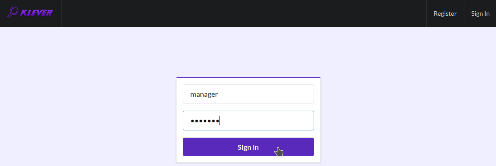

   Signing in

.. _starting_verification:

Starting Verification
---------------------

As an example we consider checking usage of clocks and memory safety in USB drivers.
To start up verification you need to do as follows:

#. Start the creation of a new *job* (:numref:`tutorial_starting_creation_new_job`).
#. Specify an appropriate title and create the new job (:numref:`tutorial_creation_new_job`).
#. To configure a first *job version* you need to specify
   (:numref:`tutorial_configuring_first_job_version_and_starting_its_decision`):

   * The path to the prepared build base that is **/home/debian/build-base-linux-5.5.19-x86_64-allmodconfig**.
   * Targets, e.g. USB drivers, i.e. all modules from directory **drivers/usb** in our example.
   * Specifications set *5.5* (you can see a list of all supported specification sets at the end of this section).
   * Requirement specifications to be checked, e.g. **drivers:clk.*** and **memory safety** in our example (you can see
     a list of all supported requirement specifications at the end of this section).

#. Press *Ctrl-S* with your mouse pointer being at the editor window to save changes.
#. Start a *decision of the job version* (:numref:`tutorial_configuring_first_job_version_and_starting_its_decision`).

After that Klever automatically redirects you to a *job version/decision page* that is described in detail in the
following sections.

.. _tutorial_starting_creation_new_job:
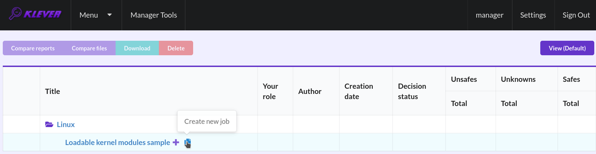

   Starting the creation of a new job

.. _tutorial_creation_new_job:
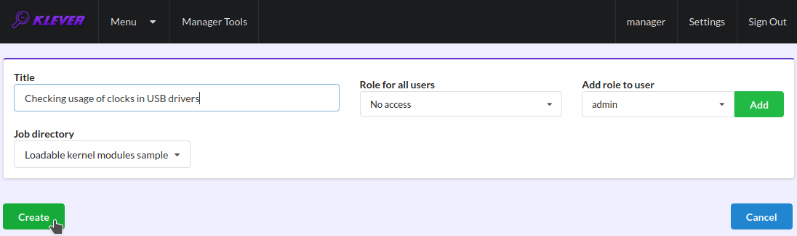

   The creation of the new job

.. _tutorial_configuring_first_job_version_and_starting_its_decision:
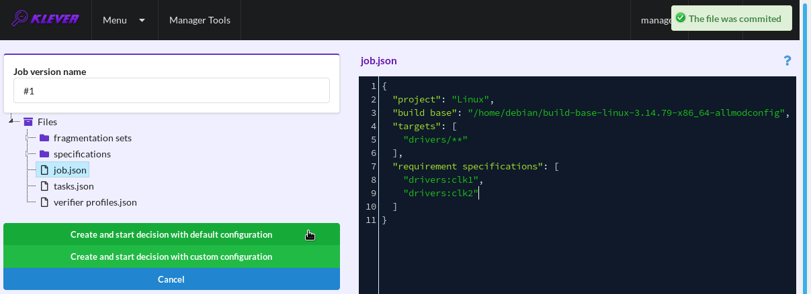

   Configuring the first job version and starting its decision

Later you can create new jobs by opening the job tree page, e.g. through clicking on the Klever logo
(:numref:`tutorial_opening_job_tree_page`), and by executing steps above.
You can create new jobs even when some job version is being decided, but various job versions are decided one by one by
default.

.. _tutorial_opening_job_tree_page:
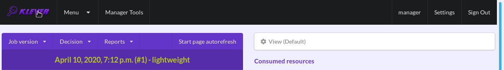

   Opening the job tree page

Below there are requirement specifications that you can choose for verification of Linux loadable kernel modules (we do
not recommend to check requirement specifications which identifiers are italicised since they produce either many false
alarms or there are just a few violations of these requirements at all):

#. alloc:irq
#. alloc:spinlock
#. alloc:usb lock
#. arch:asm:dma-mappingfile:///home/novikov/work/klever/docs/_build/html/tutorial.html#preparing-build-bases
#. arch:mm:ioremap
#. *block:blk-core:queue*
#. *block:blk-core:request*
#. *block:genhd*
#. *concurrency safety*
#. drivers:base:class
#. drivers:usb:core:usb:coherent
#. drivers:usb:core:usb:dev
#. drivers:usb:core:driver
#. drivers:usb:core:urb
#. drivers:usb:gadget:udc-core
#. drivers:clk1
#. drivers:clk2
#. fs:sysfs:group
#. kernel:locking:mutex
#. kernel:locking:rwlock
#. kernel:locking:spinlock
#. kernel:module
#. *kernel:rcu:update:lock bh*
#. *kernel:rcu:update:lock shed*
#. kernel:rcu:update:lock
#. *kernel:rcu:srcu*
#. *kernel:sched:completion*
#. *lib:find_next_bit*
#. *lib:idr*
#. memory safety
#. net:core:dev
#. *net:core:rtnetlink*
#. *net:core:sock*

In case of verification of the Linux kernel rather than vanilla 5.5, you may need to change a value of option
**specifications set** when configuring the job version
(:numref:`tutorial_configuring_first_job_version_and_starting_its_decision`).
Klever supports following specification sets:

#. 2.6.33
#. 3.2
#. 3.14
#. 3.14-dentry-v2
#. 4.6.7
#. 4.15
#. 4.17
#. 5.5
#. 5.17

These specification sets correspond to vanilla versions of the Linux kernel.
You should select such a specifications set that matches your custom version of the Linux kernel better through the
trial and error method.

Decision Progress
-----------------

At the beginning of the decision of the job version Klever indexes each new build base.
This can take rather much time before it starts to generate and to decide first *tasks*\ [4]_ for large build bases.
In about 15 minutes you can refresh the page and see results of decision for some tasks there.
Please, note that the automatic refresh of the job version/decision page stops after 5 minutes, so you either need to
refresh it through conventional means of your web browser or request Klever to switch it on back
(:numref:`tutorial_switching_on_automatic_refresh_job_version_decision_page`).

.. _tutorial_switching_on_automatic_refresh_job_version_decision_page:
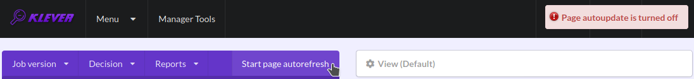

   Switching on the automatic refresh of the job version/decision page

Before the job version is eventually decided Klever estimates and provides a *decision progress*
(:numref:`tutorial_progress_decision_job_version_estimating_remaining_time` and
:numref:`tutorial_progress_decision_job_version_remaining_time_estimated`).
You should keep in mind that Klever collects statistics for 10% of tasks before it starts predicting an approximate
remaining time for their decision.
After that, it recalculates it on the base of accumulated statistics.
In our example it takes about 3 hours to decide the job version completely
(:numref:`tutorial_completed_decision_job_version`).

.. _tutorial_progress_decision_job_version_estimating_remaining_time:
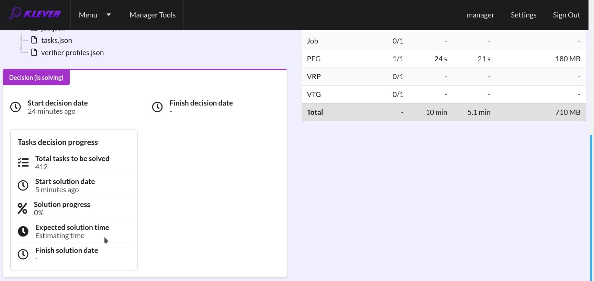

   The progress of the decision of the job version (estimating a remaining time)

.. _tutorial_progress_decision_job_version_remaining_time_estimated:
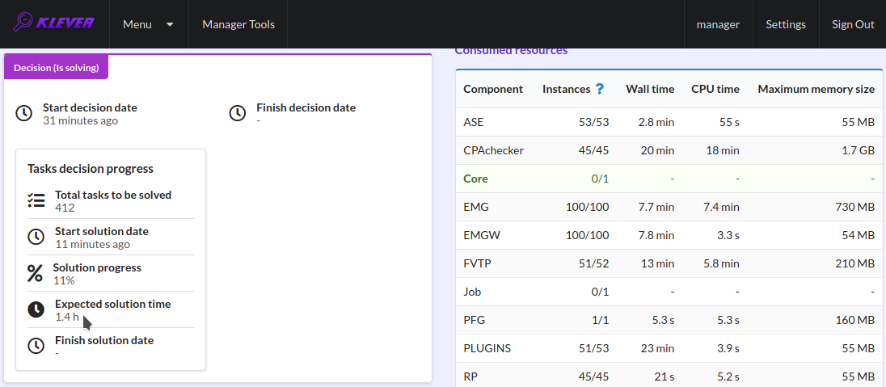

   The progress of the decision of the job version (the remaining time is estimated)

.. _tutorial_completed_decision_job_version:
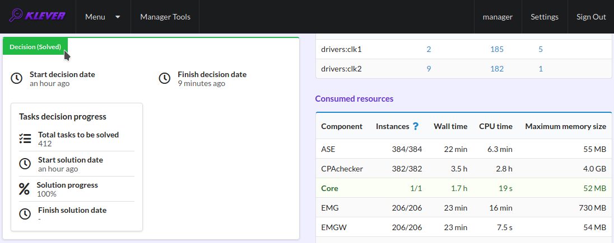

   The completed decision of the job version

At the job tree page you can see all versions of particular jobs (:numref:`tutorial_showing_job_versions`) and their
*decision statutes* (:numref:`tutorial_status_decision_job_version`).
Besides, you can open the page with details of the decision of the latest job version
(:numref:`tutorial_opening_page_with_decision_latest_job_version`) or the page describing the decision of the particular
job version (:numref:`tutorial_opening_page_with_decision_particular_job_version`).

.. _tutorial_showing_job_versions:
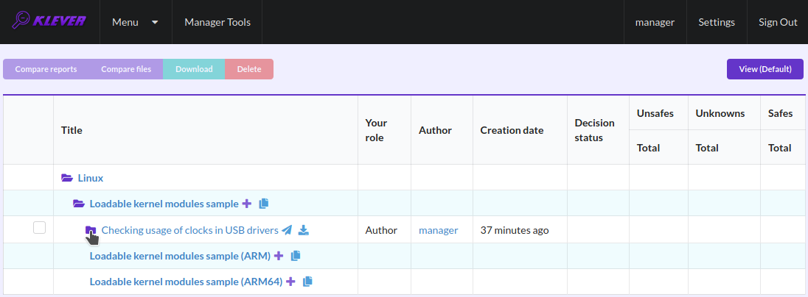

   Showing job versions

.. _tutorial_status_decision_job_version:
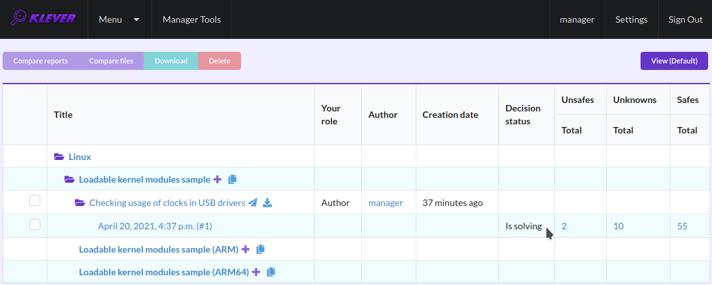

   The status of the decision of the job version

.. _tutorial_opening_page_with_decision_latest_job_version:
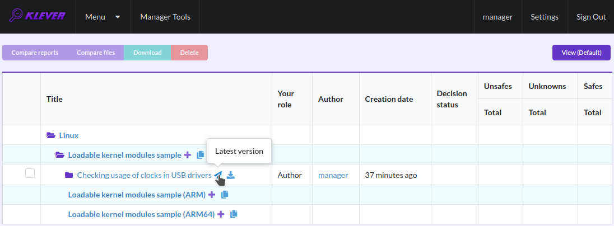

   Opening the page with the decision of the latest job version

.. _tutorial_opening_page_with_decision_particular_job_version:
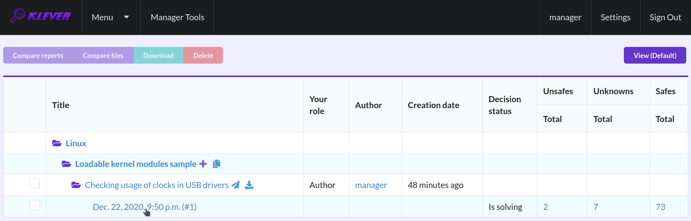

   Opening the page with the decision of the particular job version

Analyzing Verification Results
------------------------------

Klever can fail to generate and decide tasks.
In this case it provides users with *unknown* verdicts, otherwise there are *safe* or *unsafe* verdicts
(:numref:`tutorial_verdicts`).
You already saw the example with summaries of these verdicts at the job tree page
(:numref:`tutorial_status_decision_job_version`).
In this tutorial we do not consider in detail other verdicts rather than unsafes that are either violations of checked
requirements or false alarms (:numref:`tutorial_total_number_unsafes_reported_thus_far`).
Klever reports unsafes if so during the decision of the job version and you can assess them both during the decision and
after its completion.

.. _tutorial_verdicts:
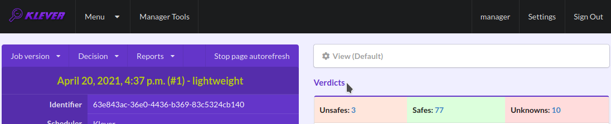

   Verdicts

.. _tutorial_total_number_unsafes_reported_thus_far:
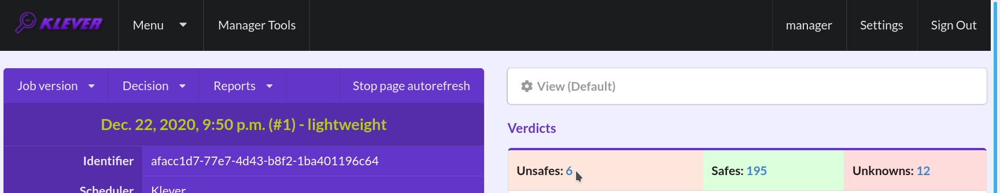

   The total number of unsafes reported thus far

During assessment of unsafes experts can create marks that can match other unsafes with similar error traces (we
consider marks and error traces in detail within next sections).
For instance, there is a mark that matches one of the reported unsafes
(:numref:`tutorial_total_number_automatically_assessed_unsafes`).
Automatic assessment can reduce efforts for analysis of verification results considerably, e.g. when verifying several
versions or configurations of the same software.
But experts should analyze such automatically assessed unsafes since the same mark can match unsafes with error traces
that look very similar but correspond to different faults.
Unsafes without marks need assessment as well (:numref:`tutorial_total_number_unsafes_without_any_assessment`).
When checking several requirement specifications in the same job, one is able to analyze unsafes just for a particular
requirements specification
(:numref:`tutorial_total_number_unsafes_corresponding_to_particular_requirements_specification`).

.. _tutorial_total_number_automatically_assessed_unsafes:

   The total number of automatically assessed unsafes

.. _tutorial_total_number_unsafes_without_any_assessment:
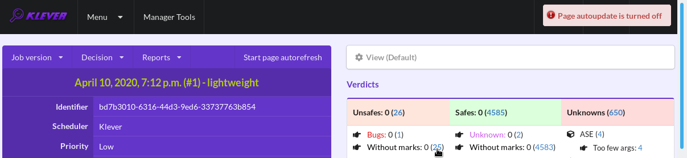

   The total number of unsafes without any assessment

.. _tutorial_total_number_unsafes_corresponding_to_particular_requirements_specification:
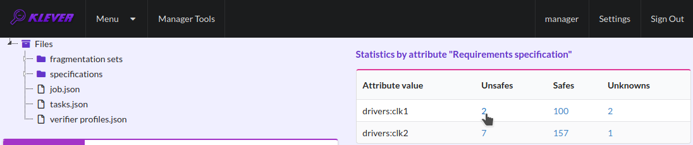

   The total number of unsafes corresponding to the particular requirements specification

After clicking on the links in :numref:`tutorial_total_number_unsafes_reported_thus_far`-
:numref:`tutorial_total_number_unsafes_corresponding_to_particular_requirements_specification`
you will be redirected to pages with lists of corresponding unsafes (e.g.
:numref:`tutorial_list_unsafes_without_any_assessment`).
If there is the only element in such a list you will see an appropriate error trace immediately.
For further analysis we recommend clicking on an unsafe index on the left to open a new page in a separate tab
(:numref:`tutorial_opening_error_trace_corresponding_to_unsafe_without_any_assessment`).
To return back to the job version/decision page you can click on the title of the job decision on the top left
(:numref:`tutorial_moving_back_to_job_version_decision_page`).
This can be done at any page with such the link.

.. _tutorial_list_unsafes_without_any_assessment:
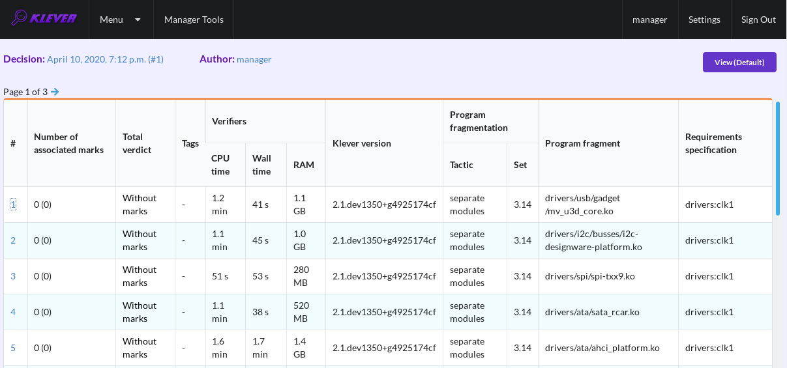

   The list of unsafes without any assessment

.. _tutorial_opening_error_trace_corresponding_to_unsafe_without_any_assessment:
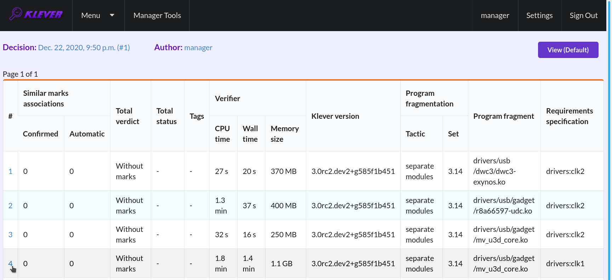

   Opening the error trace corresponding to the unsafe without any assessment

.. _tutorial_moving_back_to_job_version_decision_page:
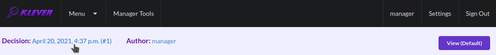

   Moving back to the job version/decision page

Analyzing Error Traces
----------------------

After clicking on links within the list of unsafes like in
:numref:`tutorial_opening_error_trace_corresponding_to_unsafe_without_any_assessment`, you will see corresponding error
traces.
For instance,
:numref:`tutorial_error_trace_for_module_drivers_usb_gadget_udc_bdc_bdc_ko_and_requirements_specification_drivers_clk1`
demonstrates an error trace example for module *drivers/usb/gadget/udc_bdc_bdc.ko* and requirements specification
*drivers:clk1*.

.. _tutorial_error_trace_for_module_drivers_usb_gadget_udc_bdc_bdc_ko_and_requirements_specification_drivers_clk1:
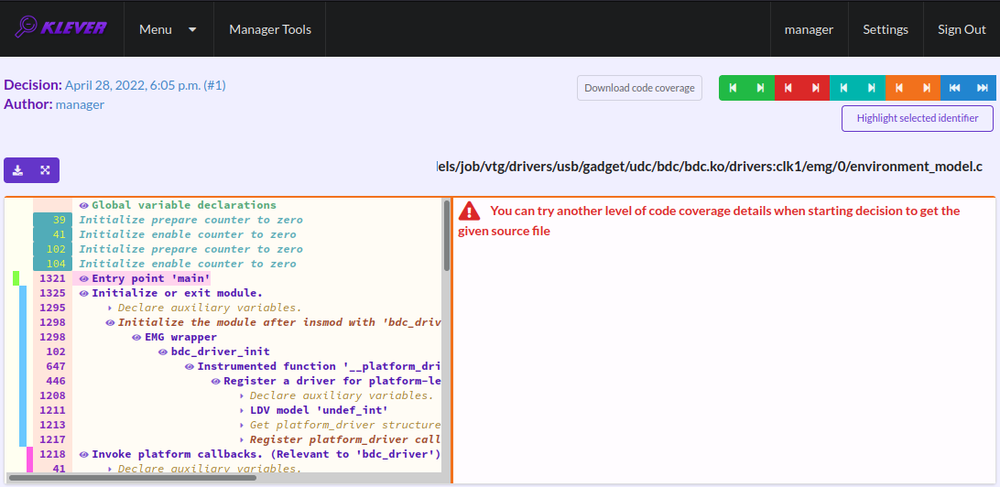

   The error trace for module drivers/usb/gadget/udc/bdc/bdc.ko and requirements specification drivers:clk1

An *error trace* is a sequence of declarations and statements in a source code of a module under verification and an
:term:`environment model <Environment model>` generated by Klever.
Besides, within that sequence there are *assumptions* specifying conditions that a verification tool considers to be
true.
Declarations, statements and assumptions represent a path starting from an entry point and ending at a violation of one
of checked requirements.
The entry point analogue for userspace programs is function *main* while for Linux loadable kernel modules entry
points are generated by Klever as a part of environment models.
Requirement violations do not always correspond to places where detected faults should be fixed.
For instance, the developer can omit a check for a return value of a function that can fail.
As a result various issues, such as leaks or null pointer dereferences, can be revealed somewhere later.

Numbers in the left column correspond to line numbers in source files and models.
Source files and models are displayed to the right of error traces.
:numref:`tutorial_error_trace_for_module_drivers_usb_gadget_udc_bdc_bdc_ko_and_requirements_specification_drivers_clk1`
does not contain anything at the right part of the window since there should be the environment model containing the
generated *main* function but by default models are not demonstrated for users in the web interface\ [5]_.
If you click on a line number corresponding to an original source file, you will see this source file as in
:numref:`tutorial_showing_line_in_original_source_file_corresponding_to_error_trace_statement`.
Error traces and source files are highlighted syntactically and you can use cross references for source files to find
out definitions or places of usage for various entities.

.. _tutorial_showing_line_in_original_source_file_corresponding_to_error_trace_statement:
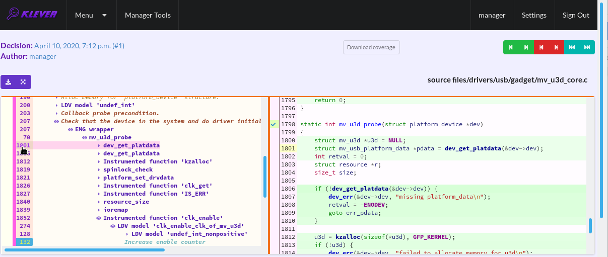

   Showing the line in the original source file corresponding to the error trace statement

You can click on eyes and on rectangles to show hidden parts of the error trace
(:numref:`tutorial_showing_hidden_declarations_statements_and_assumptions_for_functions_with_notes_or_warnings`-:numref:`tutorial_showing_hidden_declarations_statements_and_assumptions_for_functions_without_notes_or_warnings`).
Then you can hide them back if they are out of your interest.
The difference between eyes and rectangles is that functions with eyes have either notes
(:numref:`tutorial_error_trace_note`) or warnings (:numref:`tutorial_error_trace_warning`) at some point of their
execution, perhaps, within called functions.
*Notes* describe important actions in models as well as those places in source files that are related to reported
requirement violations from the standpoint of the verification tool.
*Warnings* represent places where Klever detects violations of checked requirements.

.. _tutorial_showing_hidden_declarations_statements_and_assumptions_for_functions_with_notes_or_warnings:
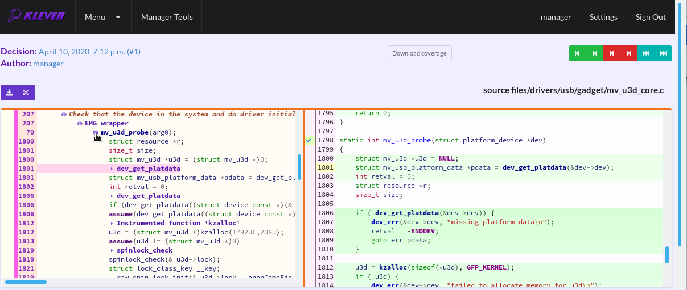

   Showing hidden declarations, statements and assumptions for functions with notes or warnings

.. _tutorial_showing_hidden_declarations_statements_and_assumptions_for_functions_without_notes_or_warnings:
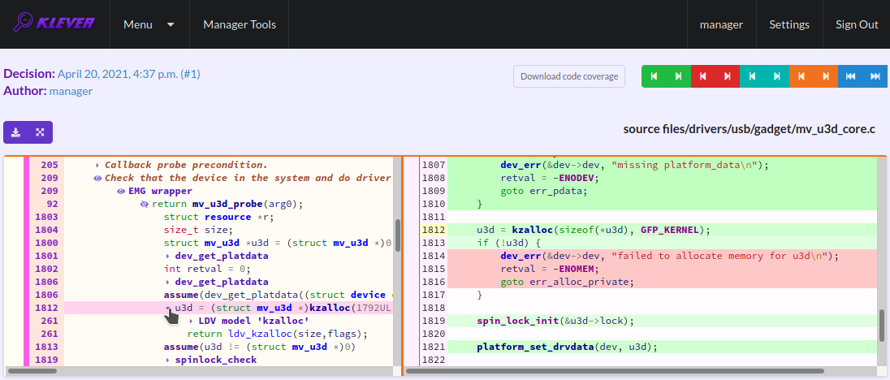

   Showing hidden declarations, statements and assumptions for functions without notes or warnings

.. _tutorial_error_trace_note:
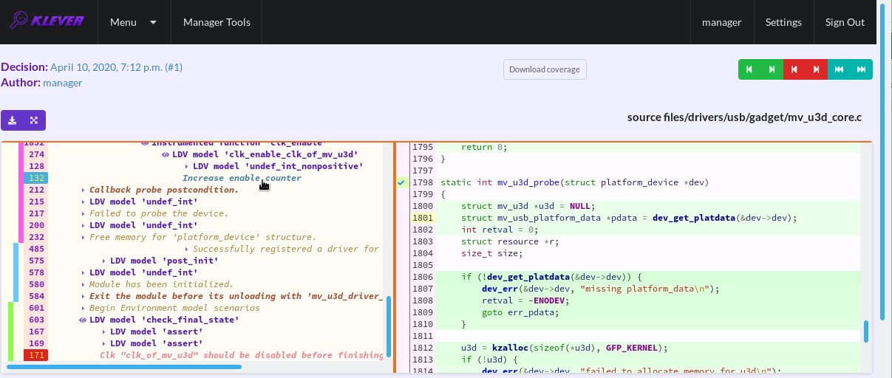

   The error trace note

.. _tutorial_error_trace_warning:
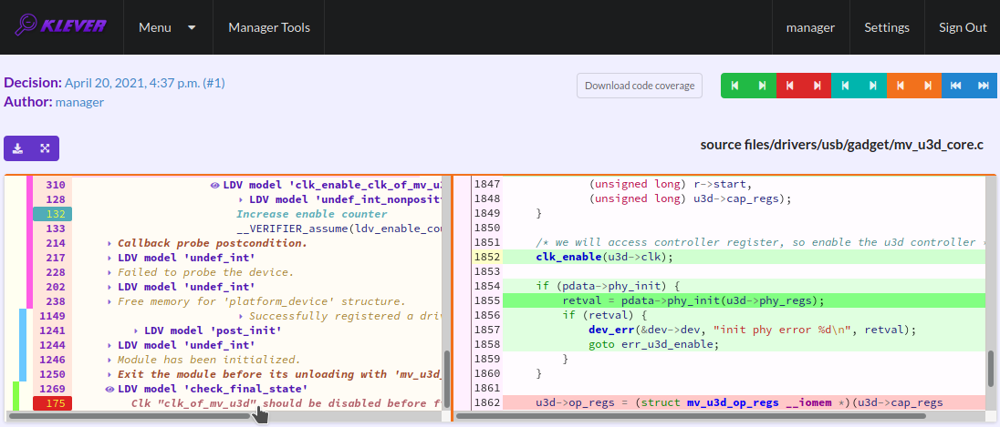

   The error trace warning

You can see that before calling module initialization and exit functions as well as module callbacks there is additional
stuff in the error trace.
These are parts of the environment model necessary to initialize models, to invoke module interfaces in the way the
environment does and to check the final state.
This tutorial does not consider models in detail, but you should keep in mind that Klever can detect faults not only
directly in the source code under verification but also when checking something after execution of corresponding
functions.
For instance, this is the case for the considered error trace (:numref:`tutorial_error_trace_warning`).

Creating Marks
--------------

The analyzed unsafe corresponds to the fault that was fixed in upstream commits
`d2f42e09393c <https://git.kernel.org/pub/scm/linux/kernel/git/torvalds/linux.git/commit/?id=d2f42e09393c>`__
and `6f15a2a09cec <https://git.kernel.org/pub/scm/linux/kernel/git/torvalds/linux.git/commit/?id=6f15a2a09cec>`__
to the Linux kernel.
To finalize assessment you need to create a new *mark*
(:numref:`tutorial_starting_creation_of_new_lightweight_mark`-:numref:`tutorial_creation_of_new_lightweight_mark`):

#. Specify a verdict (**Bug** in our example).
#. Specify a status (**Fixed**).
#. Provide a description.
#. Save the mark.

.. _tutorial_starting_creation_of_new_lightweight_mark:
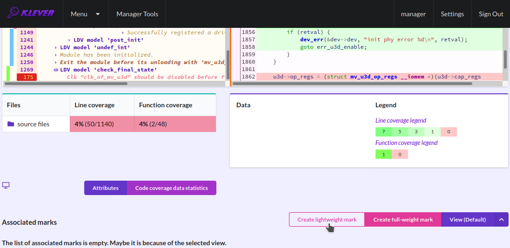

   Starting the creation of a new lightweight mark

.. _tutorial_creation_of_new_lightweight_mark:
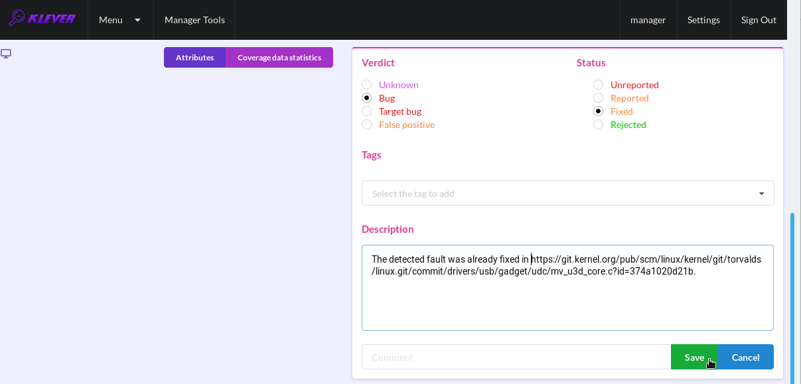

   The creation of the new lightweight mark

After that you will be automatically redirected to the page demonstrating changes in total verdicts
(:numref:`tutorial_changes_in_total_verdicts`).
In our example there is the only change that corresponds to the analyzed unsafe and the new mark.
But in a general case there may be many changes since the same mark can match several unsafes, and you may need to
investigate these changes.

.. _tutorial_changes_in_total_verdicts:
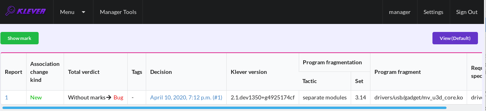

   Changes in total verdicts

After creating the mark you can see the first manually assessed unsafe
(:numref:`tutorial_total_number_of_manually_assessed_unsafes`).
Besides, as it was already noted, you should investigate automatically assessed unsafes by analyzing corresponding error
traces and marks and by (un)confirming their associations
(:numref:`tutorial_opening_error_trace_of_unsafe_with_automatic_assessment`-:numref:`tutorial_confirming_automatic_association`).

.. _tutorial_total_number_of_manually_assessed_unsafes:
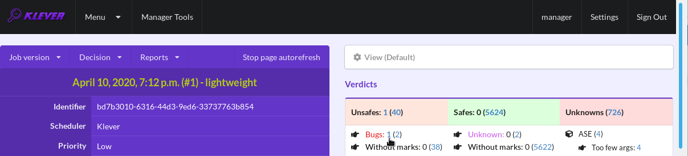

   The total number of manually assessed unsafes

.. _tutorial_opening_error_trace_of_unsafe_with_automatic_assessment:
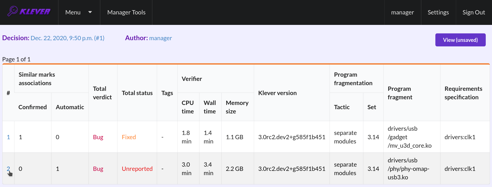

   Opening the error trace of the unsafe with automatic assessment

.. _tutorial_confirming_automatic_association:
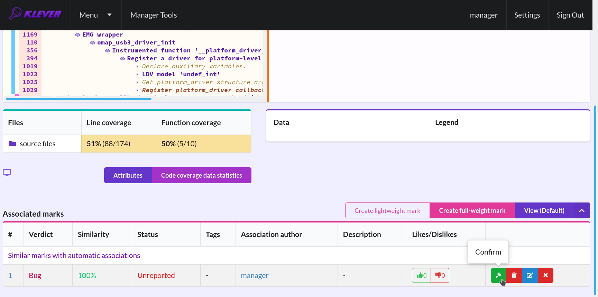

   Confirming the automatic association

False alarms can happen due to different reasons.
You can find a tree of corresponding *tags* representing most common false alarm reasons at
:menuselection:`Menu --> Marks --> Tags` (:numref:`tutorial_opening_tags_page`).

.. _tutorial_opening_tags_page:
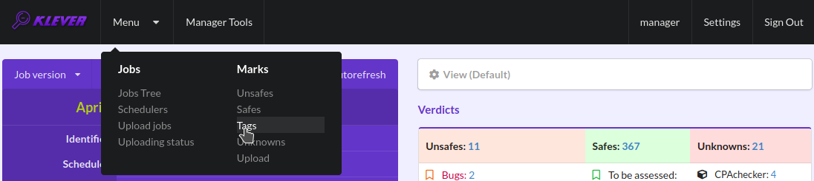

   Opening the tags page

Each tag has a description that is shown when covering a tag name (:numref:`tutorial_showing_tag_description`).

.. _tutorial_showing_tag_description:
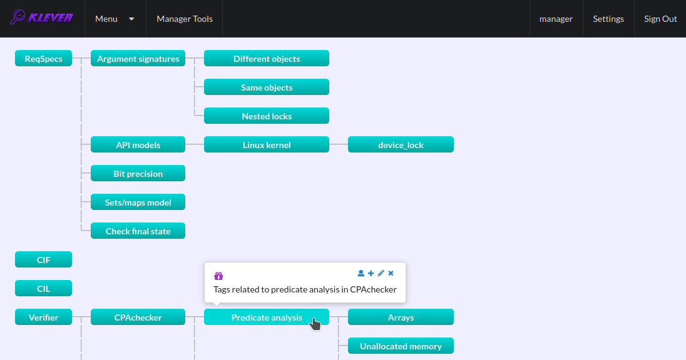

   Showing tag description

You can choose appropriate tags during creation of marks from the dropdown list
(:numref:`tutorial_choosing_tag_dropdown_list`).
This list can be filtered out by entering parts of tag names (:numref:`tutorial_entering_tag_name_part`).

.. _tutorial_choosing_tag_dropdown_list:
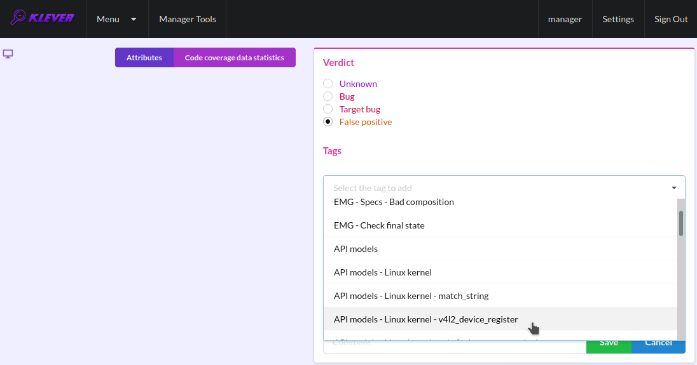

   Choosing tag from the dropdown list

.. _tutorial_entering_tag_name_part:
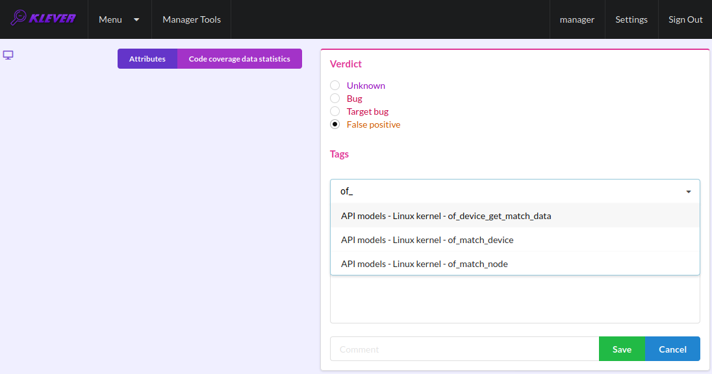

   Entering tag name part

Analysis of Code Coverage Reports
---------------------------------

Code coverage reports demonstrate parts (lines and functions at the moment) of the target program source code and
models that were considered during verification.
Though users can expect complete code coverage because programs are analyzed statically, actually this may not be the
case due to incomplete or inaccurate environment models that make some code unreachable or due to some limitations of
verification tools, e.g. they can ignore calls of functions through function pointers.
When users need good or excellent completeness of verification it is necessary to study code coverage reports.

There is different semantics of code coverage for various verdicts:

* *Unsafes* - code coverage reports show exactly those parts of the source code that correspond to error traces.
  You will get another code coverage after eliminating reasons of corresponding unsafes.
* *Safes* - code coverage reports show all parts of the source code that the verification tool analyzed.
  You should keep in mind that there may be different reasons like specified above that prevent the verification tool
  from reaching complete code coverage.
  Since Klever lacks correctness proofs (currently, verification tools do not provide useful correctness proofs),
  analysis of code coverage reports becomes the only approach for understanding whether safes are good or not.
* *Unknowns* (*Timeouts*) - code coverage shows those parts of the target program source code that the verification tool
  could investigate until it was terminated after exhausting the specified amount of CPU time.
  You can find out and change corresponding limits in file *tasks.json* (for instance, see
  :numref:`tutorial_configuring_first_job_version_and_starting_its_decision`).

By default, Klever provides users with code coverage reports just for the target program source code.
If one needs to inspect code coverage for various models it is necessary to start the decision of the job with a custom
configuration where setting "Code coverage details" should be either "C source files including models" or
"All source files".
This can result in quite considerable overhead, so it is not always switched on.

Code Coverage Reports for Unsafes
^^^^^^^^^^^^^^^^^^^^^^^^^^^^^^^^^

For unsafes, you will see code coverage reports when analyzing corresponding error traces like in
:numref:`tutorial_code_coverage_report_unsafe_error_trace`.
Code coverage of a particular source file is shown on the right.
There is a code coverage legend beneath it.
The pink background and red crosses point out uncovered lines and functions respectively.
More times lines were analyzed during verification more intensive green background is used for them.
Green ticks denote covered functions.

.. _tutorial_code_coverage_report_unsafe_error_trace:
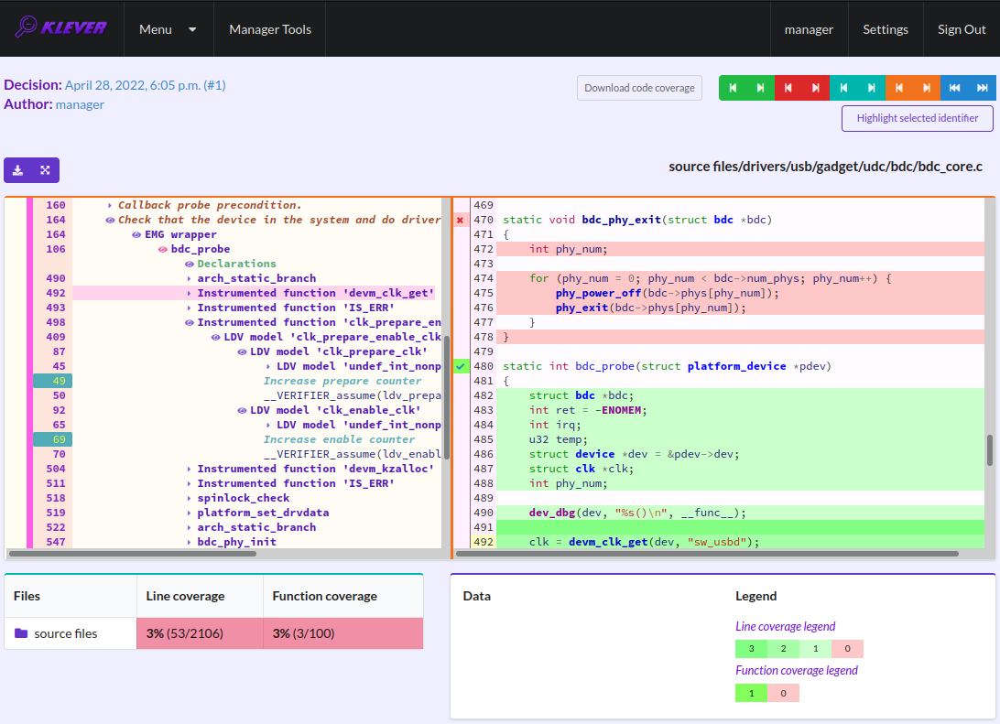

   Code coverage report for the unsafe error trace

There is code coverage statistics as well as a source tree on the left of the code coverage legend
(:numref:`tutorial_code_coverage_statistics`).
You can click on names of directories and source files to reveal corresponding statistics and to show code coverage for
these source files (:numref:`tutorial_opening_code_coverage_for_particular_source_file`).
The latter has sense for tasks consisting of several source files.

.. _tutorial_code_coverage_statistics:
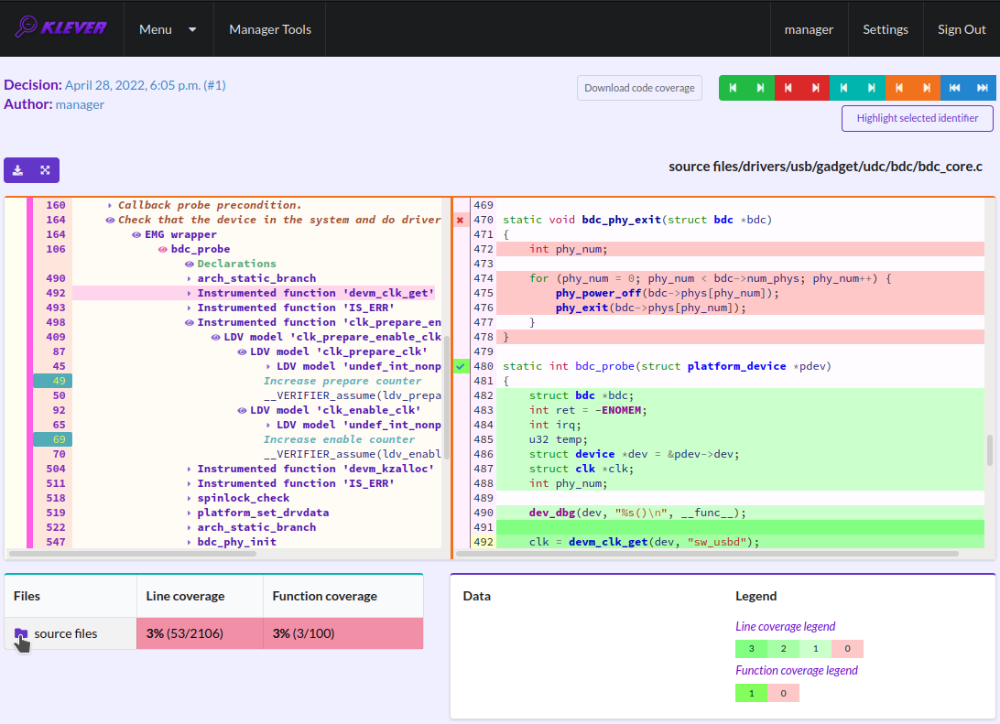

   Code coverage statistics

.. _tutorial_opening_code_coverage_for_particular_source_file:
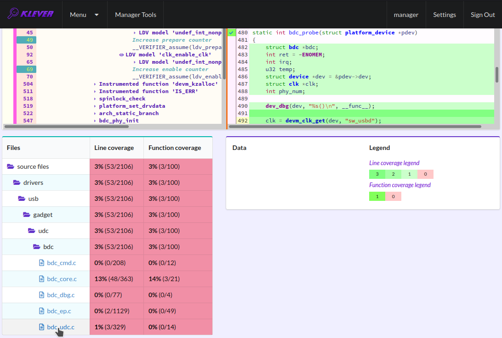

   Opening code coverage for the particular source file

Code Coverage Reports for Safes
^^^^^^^^^^^^^^^^^^^^^^^^^^^^^^^

To open code coverage reports for safes you need to open a page with a list of safes
(:numref:`tutorial_opening_page_with_list_of_safes`) and then open a particular safe page
(:numref:`tutorial_opening_safe_page`).
Like for unsafe you can analyze the code coverage legend and statistics as well as to show code coverage for particular
source files (:numref:`tutorial_code_coverage_report_for_safe`).

.. _tutorial_opening_page_with_list_of_safes:
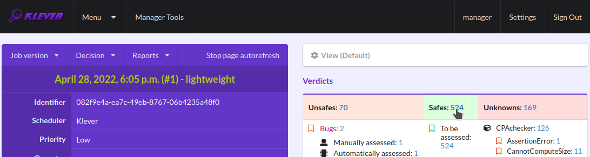

   Opening page with the list of safes

.. _tutorial_opening_safe_page:
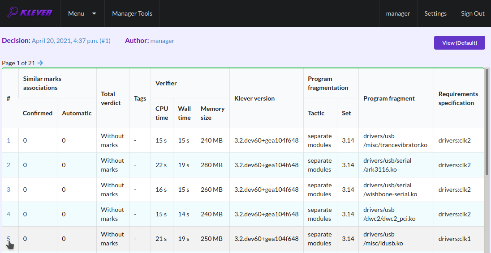

   Opening safe page

.. _tutorial_code_coverage_report_for_safe:
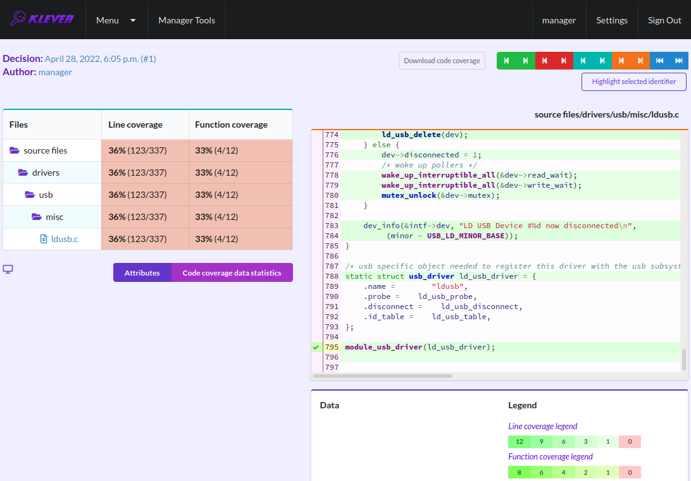

   Code coverage report for the safe

The safe verdict does not imply program correctness since some parts of the program could be not analyzed at all and
thus uncovered.
To navigate to the next uncovered function you should press the red button with the arrow
(:numref:`tutorial_showing_next_uncovered_function`).
Then you can find places where this uncovered function is invoked and why this was not done during verification (in the
considered case this was due to lack of environment model specifications for callbacks of the *usb_class_driver*
structure).
Besides, while a function can be covered there may be uncovered lines within it.
For instance, this may be the case due to the verification tool assumes that some conditions are always true or false.

.. _tutorial_showing_next_uncovered_function:
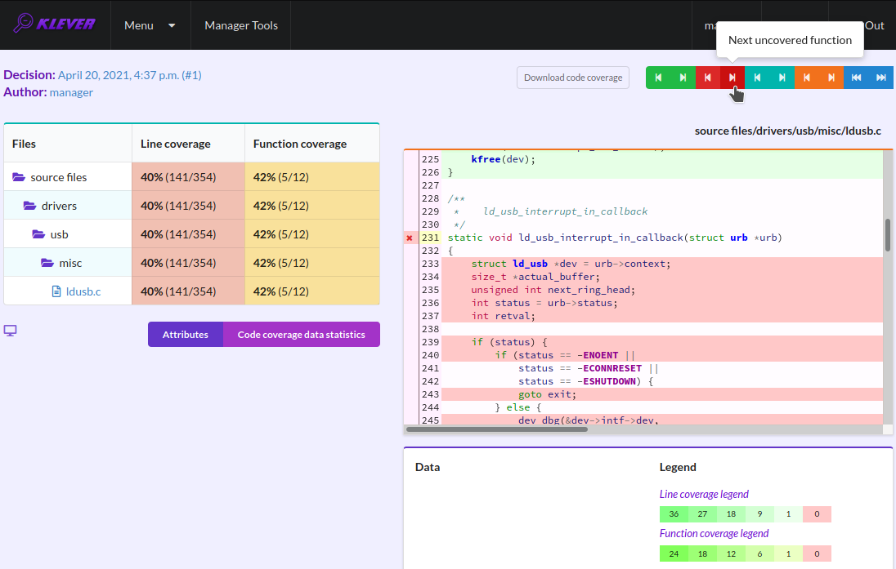

   Showing next uncovered function

Code Coverage Reports for Unknowns
^^^^^^^^^^^^^^^^^^^^^^^^^^^^^^^^^^

If you would like to investigate the most complicated parts of the target program source code that can cause unknown
(timeout) verdicts, you should open a page with a list of timeouts (:numref:`tutorial_opening_page_with_list_of_timeouts`) and
then open a particular timeout page (:numref:`tutorial_opening_timeout_page`).
A timeout code coverage report (:numref:`tutorial_code_coverage_report_for_timeout`) looks almost like the safe code
coverage report (:numref:`tutorial_code_coverage_report_for_safe`).

.. _tutorial_opening_page_with_list_of_timeouts:
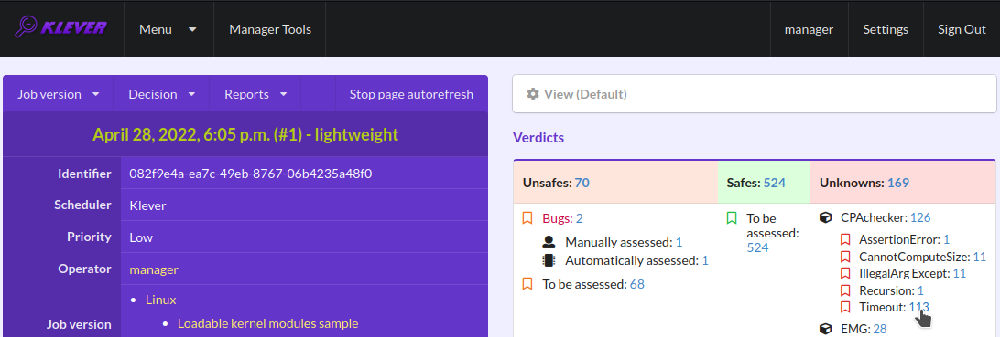

   Opening page with the list of timeouts

.. _tutorial_opening_timeout_page:
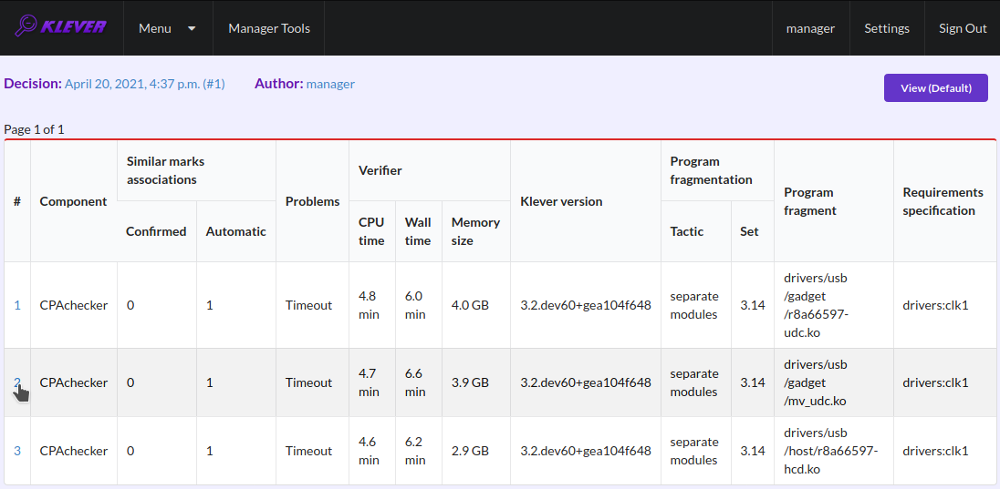

   Opening timeout page

.. _tutorial_code_coverage_report_for_timeout:
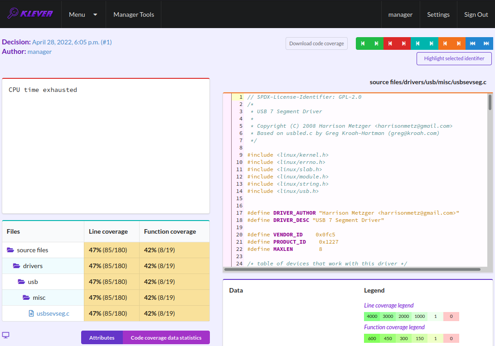

   Code coverage report for the timeout

To traverse through most covered lines that likely took most of the verification time you should press the orange button
with the arrow (:numref:`tutorial_showing_next_most_covered_line`).
If the task includes more than one source file it may be helpful for you to investigate lines that are most covered
globally.
For this it is necessary to press the blue button with the arrow.
Quite often loops can serve as a source of complexity especially when loop boundaries are not specified/modelled
explicitly.

.. _tutorial_showing_next_most_covered_line:
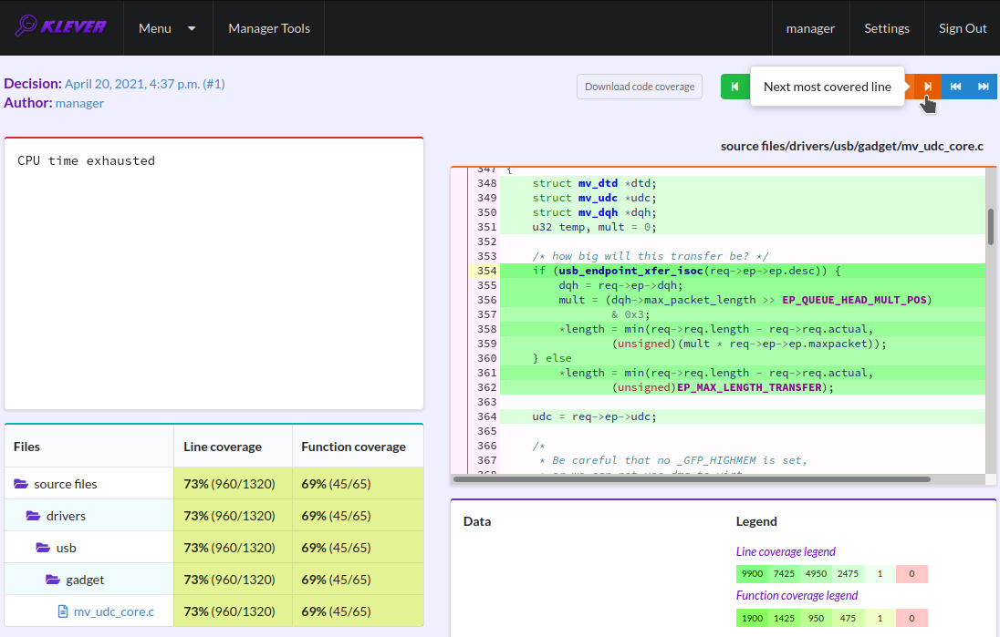

   Showing next most covered line

You can find more details about verification results and their expert assessment in [G20]_.

What’s Next?
------------

We assume that you can be unsatisfied fully with a quality of obtained verification results.
Perhaps, you even could not obtain them at all.
This is expected since Klever is an open source software developed in Academy and we support verification of Linux
kernel loadable modules for evaluation purposes primarily.
Besides, this tutorial misses many various use cases of Klever.
Some of these use cases are presented in other top-level sections of the user documentation.
We are ready to discuss different issues and fix crucial bugs.

.. [1]
   If this is not the case, you should adjust paths to build bases below respectively.

.. [2]
   Several build bases are deployed together with Klever by default, but they contain just a small subset of Linux
   kernel loadable modules.
   The corresponding Linux kernel version is 3.14.79, target architectures are x86-64, ARM and ARM64.

.. [3]
   You can open the Klever web interface from other machines as well, but you need to set up appropriate access for
   that.

.. [4]
   For the considered example each task is a pair of a Linux loadable kernel module and a requirements specification.
   There are 259 modules under verification and 3 requirement specifications to be checked, so there are 777 tasks in
   total.

.. [5]
   If you want to see these models, you have to start the decision of the job version with a custom configuration
   (:numref:`tutorial_configuring_first_job_version_and_starting_its_decision`).
   There you should select value "C source files including models" for option "Code coverage details".
   You should keep in mind that this will considerably increase the time necessary for generation of tasks and the
   overall time of the decision of the job version.

.. [G20] Gratinskiy V.A., Novikov E.M., Zakharov I.S. Expert Assessment of Verification Tool Results. Proceedings of the
         Institute for System Programming of the RAS (Proceedings of ISP RAS), volume 32, issue 5, pp. 7-20. 2020.
         https://doi.org/10.15514/ISPRAS-2020-32(5)-1. (In Russian)
