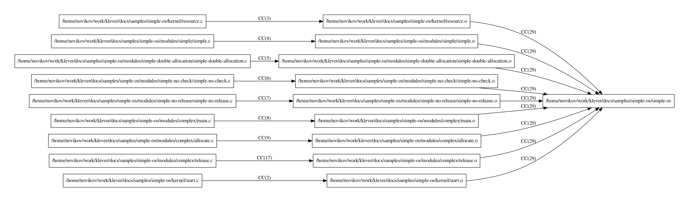

.. Copyright (c) 2022 ISP RAS (http://www.ispras.ru)
   Ivannikov Institute for System Programming of the Russian Academy of Sciences
   Licensed under the Apache License, Version 2.0 (the "License");
   you may not use this file except in compliance with the License.
   You may obtain a copy of the License at
       http://www.apache.org/licenses/LICENSE-2.0
   Unless required by applicable law or agreed to in writing, software
   distributed under the License is distributed on an "AS IS" BASIS,
   WITHOUT WARRANTIES OR CONDITIONS OF ANY KIND, either express or implied.
   See the License for the specific language governing permissions and
   limitations under the License.

.. _verifying_new_program:

Verifying New Program
=====================

This tutorial shows how one can verify a new program with help of Klever.
As an example we consider Simple OS developed for the sake of the given tutorial.
Simple OS is an artificial operating system including a kernel and a set of modules that are compiled and linked
together into executable file :file:`simple-os`.
Their source code is located at directory :term:`$KLEVER_SRC`:file:`/docs/samples/simple-os`.
You are able to modify any existing source files and scripts as well as to add new ones if you want to check something
in addition.
We will be glad to accept any interesting contribution.

You should examine common :ref:`tutorial` beforehand since we will not duplicate its content here.
Besides, it would be great if you will be familiar at least to some extent with other topics like
:ref:`dev_decomposition_conf`, :ref:`dev_common_api_models` and :ref:`dev_req_specs`.
Everything below should work well for the :ref:`local production instance of Klever <local_deploy>`, but we recommend
installing Klever in the development mode locally, especially if you are going to perform extra experiments.

Preparing Build Base
--------------------

At the first step you need to prepare a :ref:`build base <klever_build_bases>` for Simple OS\ [1]_.
For that purpose you should execute the following commands::

   $ cd $KLEVER_SRC/docs/samples/simple-os
   $ clade -c clade.json --cif $KLEVER_DEPLOY_DIR/klever-addons/CIF/bin/cif make -j8

The resulting build base will be placed at directory :term:`$KLEVER_SRC`:file:`/docs/samples/simple-os/clade`.
To regenerate the build base, e.g. after changing program source files, you should run the following commands before
launching Clade::

   $ make clean && rm -rf clade

After successful preparation of the build base that includes the normal build process, you can run Simple OS.
It is not necessary for its verification by means of Klever, but this clarifies its workflow and demonstrates
possible bugs.

The first command-line argument for :file:`simple-os` specifies a module to be launched:

* *0* is *simple*.
* *1* is *simple-double-allocation* (there is a specially introduced bug).
* *2* is *simple-no-check* (there is a bug).
* *3* is *simple-no-release* (there is a bug).
* *4* is *complex*.

The second command-line argument for :file:`simple-os` provides the only integer argument to a module initialization
function.

Here are several examples of launching modules (we encourage you to try more examples, especially if you modify
anything in the source code of Simple OS)::

   # Module "simple" properly handles all invalid inputs and follows rules of correct usage of the kernel API.
   $ ./simple-os 0 2; echo "Kernel exit code is '$?'"
   Kernel resource was successfully allocated and initialized.
   Kernel resource was successfully released.
   Kernel exit code is '0'
   $ ./simple-os 0 3; echo "Kernel exit code is '$?'"
   Allocation of kernel resource with odd initial values always fails.
   Module initialization fails with '-100' error code.
   Kernel exit code is '156'
   $ ./simple-os 0 10; echo "Kernel exit code is '$?'"
   Kernel resource was successfully allocated and initialized.
   Kernel resource was successfully released.
   Kernel exit code is '0'
   $ ./simple-os 0 0; echo "Kernel exit code is '$?'"
   Initial value for kernel resource should not be '0'.
   Module initialization fails with '-100' error code.
   Kernel exit code is '156'

   # Module "simple-double-allocation" performs invalid double allocation of kernel resource.
   $ ./simple-os 1 2; echo "Kernel exit code is '$?'"
   Kernel resource was successfully allocated and initialized.
   You should not allocate kernel resource twice.
   Kernel resource was successfully released.
   Module initialization fails with '-101' error code.
   Kernel exit code is '155'
   $ ./simple-os 1 3; echo "Kernel exit code is '$?'"
   Allocation of kernel resource with odd initial values always fails.
   Module initialization fails with '-100' error code.
   Kernel exit code is '156'

   # Module "simple-no-check" does not check for status of kernel resource allocation.
   $ ./simple-os 2 2; echo "Kernel exit code is '$?'"
   Kernel resource was successfully allocated and initialized.
   Kernel resource was successfully released.
   Kernel exit code is '0'
   $ ./simple-os 2 3; echo "Kernel exit code is '$?'"
   Allocation of kernel resource with odd initial values always fails.
   Segmentation fault (core dumped)
   Kernel exit code is '139'

   # Module "simple-no-release" forgets to release allocated kernel resource in some cases.
   $ ./simple-os 3 2; echo "Kernel exit code is '$?'"
   Kernel resource was successfully allocated and initialized.
   Kernel resource was successfully released.
   Kernel exit code is '0'
   $ ./simple-os 3 3; echo "Kernel exit code is '$?'"
   Allocation of kernel resource with odd initial values always fails.
   Module initialization fails with '-100' error code.
   Kernel exit code is '156'
   $ ./simple-os 3 10; echo "Kernel exit code is '$?'"
   Kernel resource was successfully allocated and initialized.
   Module allocated kernel resource, but it did not release it.
   Kernel exit code is '246'

   # Module "complex" is correct as module "simple", but it consists of several source files.
   $ ./simple-os 4 2; echo "Kernel exit code is '$?'"
   Kernel resource was successfully allocated and initialized.
   Kernel resource was successfully released.
   Kernel exit code is '0'
   $ ./simple-os 4 3; echo "Kernel exit code is '$?'"
   Allocation of kernel resource with odd initial values always fails.
   Module initialization fails with '-101' error code.
   Kernel exit code is '155'

Build processes can be very project specific.
We can only recommend getting a successful standalone build first and then to wrap it with Clade that should also finish
successfully.
You can build the whole project even though you are going to verify only its subset.
For the rest you should investigate the project documentation, contact developers or be one of them.

Developing Project Specific Adaptation
--------------------------------------

Klever should be taught so that it will be aware what parts of your project should be verified and what should be
checked for them.
The appropriate stuff in general is referred to as a *project specific adaptation*.
This section will demonstrate the project specific adaptation for Simple OS.
It is worth noting, that we are going to verify only separate modules of Simple OS.

We include the project specific adaptation for Simple OS into the repository to simplify the tutorial.
Nevertheless, you can track that it corresponds to the following description and even recreate it from scratch similarly
but with slightly different names and identifiers.

Describing new preset verification job
^^^^^^^^^^^^^^^^^^^^^^^^^^^^^^^^^^^^^^

First of all you should describe a new preset verification job.
For this it is necessary to create directory :term:`$KLEVER_SRC`:file:`/presets/jobs/simpleos/modules` and put files
:file:`job.json` and :file:`tasks.json` there.

:file:`job.json` may look as follows (you can find some details about specified attributes in
:ref:`starting_verification`):

.. code-block:: json

  {
    "project": "SimpleOS",
    "build base": "$KLEVER_SRC/docs/samples/simple-os/clade",
    "targets ": ["**"],
    "specifications set": "1.0",
    "requirement specifications": [".*"]
  }

.. note:: You should replace $KLEVER_SRC with an actual path above.

You can copy :file:`tasks.json` from, say,
:term:`$KLEVER_SRC`:file:`/presets/jobs/linux/loadable kernel modules sample/tasks.json`.
The given tutorial does not consider attributes from that file as well as any modifications of them.

Then you need to refer to the new preset verification job in the verification job base.
For that goal you can add the following description at the end of file
:term:`$KLEVER_SRC`:file:`/presets/jobs/base.json`:

.. code-block:: json

  {
    "name": "Simple OS",
    "uuid": "42963a02-abb4-4bc7-a7d1-cdfa1d16d072",
    "production": true,
    "children": [
      {
        "uuid": "fa433698-80e9-4076-b95b-2dad8cbe7e6c",
        "name": "Modules",
        "directory": "simpleos/modules",
        "production": true
      }
    ]
  }

The verification job base represents a set of trees where:

* Roots correspond to different projects.
* Intermediate nodes can help to arrange a lot of various preset verification jobs, e.g. you can see on a tree for the
  Linux kernel.
* Leaves correspond to preset verification jobs themselves.
  Only leaves can have attribute *directory*, and you can create actual verification jobs only on the base of leaves.

These trees are reflected in the Klever web interface, e.g. :numref:`tutorial_starting_creation_new_job`.
Attributes in the verification job base have the following meaning:

* *name* - a user-friendly name of a preset verification job, e.g. "Modules" in the example above, or its parents, e.g.
  "Simple OS".
* *uuid* - a `universally unique identifier <https://en.wikipedia.org/wiki/Universally_unique_identifier>`__.
  It should be unique across the verification job base.
  You can take any existing UUID from the verification job base, modify it slightly and use for new preset verification
  jobs as well as their parents.
* *production* - whether a preset verification job and its parents should be populated for the production instance of
  Klever.
  We recommend you to use value *true* for this attribute unless you are going to set up any special-purpose preset
  verification jobs, e.g. verification jobs for testing and validation.
* *directory* - a path to a directory where you put files :file:`job.json` and :file:`tasks.json`.
  This path should be relative to directory :term:`$KLEVER_SRC`:file:`/presets/jobs`.

Describing program fragments
^^^^^^^^^^^^^^^^^^^^^^^^^^^^

.. note:: You should read :ref:`dev_decomposition_conf` to understand this subsection better.

:numref:`pfg_cmd_graph_with_files` demonstrates the command graph for Simple OS.
You can find it also in file
:term:`$KLEVER_SRC`:file:`/docs/samples/simple-os/clade/CmdGraph/cmd_graph_with_files.dot.pdf` after successful
preparation of the build base.

.. _pfg_cmd_graph_with_files:

   Command graph for Simple OS

The command graph demonstrates GCC commands (compilation and linkage) that forms final executable file :file:`simple-os`
from a set of input program source files.
As it was aforementioned, we are focusing on individual modules in the given tutorial.
That is why we can describe them manually in file
:term:`$KLEVER_SRC`:file:`/presets/jobs/fragmentation sets/SimpleOS.json`, for instance:

.. literalinclude:: ../presets/jobs/fragmentation sets/SimpleOS.json
   :language: json

With this configuration we will have 5 program fragments corresponding exactly to modules.
Manual description may be a good option in case of stable and simple projects.
For large, evolving projects it would be better to develop a script that will automatically construct necessary
program fragments and filter out everything irrelevant.
You can find examples of these scripts in directory :term:`$KLEVER_SRC`:file:`/klever/core/pfg/fragmentation`.

Describing requirement specifications
^^^^^^^^^^^^^^^^^^^^^^^^^^^^^^^^^^^^^

.. note:: We encourage you to read :ref:`dev_common_api_models` and :ref:`dev_req_specs` prior to diving into this
          subsection.

Klever needs custom models and requirement specifications for each new project.
Their top level description for Simple OS is resided in requirement specifications base
:term:`$KLEVER_SRC`:file:`/presets/jobs/specifications/SimpleOS.json`:

.. literalinclude:: ../presets/jobs/specifications/SimpleOS.json
   :language: json

The requirement specifications base refers some common models and headers.
Besides, most attributes are typical.
Below we consider models and settings that are specific for Simple OS.

The value for attribute *functions to call* is *["\\w*init"]*.
It means that generated environment models will contain only calls to module initialization functions.
In the case of modules of Simple OS it is enough since they have only such entry points.

The value for attribute *model compiler input file* is *kernel/start.c*.
Indeed, you can specify any program source file that is compiled during preparation of the build base and that has
compilation options suitable for building models.

Model :term:`$KLEVER_SRC`:file:`/presets/jobs/specifications/simpleos/verifier/memory.c` represents models for
memory allocation and free:

.. literalinclude:: ../presets/jobs/specifications/simpleos/verifier/memory.c
   :language: c

These models refer corresponding reference models the verification tool familiar with.
Simple OS does not have any specific restrictions for dealing with the dynamic memory, so models do not do anything
specific.

The requirement specifications base describes 3 requirement specifications some of which refer certain models:

* *empty*
* *kernel:resource*
* *memory safety*

*empty* is intended for getting code coverage, i.e. code reachable with a given environment model.
It does not reveal any issues in target modules of Simple OS.

*kernel:resource* represents checks for correct usage of the kernel resource API.
This requirements specification refers model
:term:`$KLEVER_SRC`:file:`/presets/jobs/specifications/simpleos/kernel/resource.c`:

.. literalinclude:: ../presets/jobs/specifications/simpleos/kernel/resource.c
   :language: c

Besides, it implicitly refers aspect
:term:`$KLEVER_SRC`:file:`/presets/jobs/specifications/simpleos/kernel/resource.aspect`:

.. literalinclude:: ../presets/jobs/specifications/simpleos/kernel/resource.aspect
   :language: c

The following requirements are checked by the given requirements specification:

* Each module can allocate kernel resource only once.
* Module can release only allocated kernel resource.
* Kernel resource should be released at the end of work.

*memory safety* checks for memory safety, i.e. absence of NULL pointer dereferences, buffer overflows, memory leaks,
etc.
Regarding performed checks it is similar to the namesake requirements specification dedicated for the Linux kernel, but
it refers another model
:term:`$KLEVER_SRC`:file:`/presets/jobs/specifications/simpleos/memory safety/memory.c`:

.. literalinclude:: ../presets/jobs/specifications/simpleos/memory safety/memory.c
   :language: c

and aspect :term:`$KLEVER_SRC`:file:`/presets/jobs/specifications/simpleos/memory safety/memory.aspect`:

.. literalinclude:: ../presets/jobs/specifications/simpleos/memory safety/memory.aspect
   :language: c

Running Verification
--------------------

After you described the new preset verification job, you need to populate related files once.
For this you should open *Manager Tools* in the Klever web interface, select *preset jobs* and populate them.

Then you can create any number of verification jobs on the base of the populated preset verification job and start
their decision.
Corresponding configuration files, models, and specifications will be automatically updated from the repository each
time if you are using Klever in the development mode.
This process as well as expert assessment of verification results are considered in details in :ref:`tutorial`.

After all if everything will go well, you will get 15 verification tasks (5 modules are verified against 3 requirement
specifications) resulting to 4 unsafes and 11 safes:

* Requirements specification *empty* demonstrates only safes and code coverage as expected.
* Requirements specification *kernel:resource* catches 3 bugs corresponding to all its checks.
* Requirements specification *memory safety* reports a NULL pointer dereference.

Further Steps
-------------

You can try to adapt this tutorial to support verification of your program.
Do not worry, if you will make any mistakes in file names and their contents along the way.
Klever should report you rather clear error messages in this case, so that you will be able to fix different issues step
by step.
For instance, there was about 20 unsuccessful attempts at verification of Simple OS when developing everything necessary
for this tutorial.

You should keep in mind that this tutorial does not cover all aspects of using Klever.
In particular, it does not touch complicated environment modeling, development of advanced requirement specifications
and some other things.
Some of these topics are considered in separate sections of the given user documentation, e.g. you can find details for
the former in :ref:`dev_env_model_specs`.

If you will encounter any issues, and you will have any questions, please, contact us for support.

.. [1]
   The build base for Simple OS prepared in advanced is deployed together with Klever by default.
   You can refer to it as *simple-os* in :file:`job.json`, but we advise you to prepare the build base yourself.
